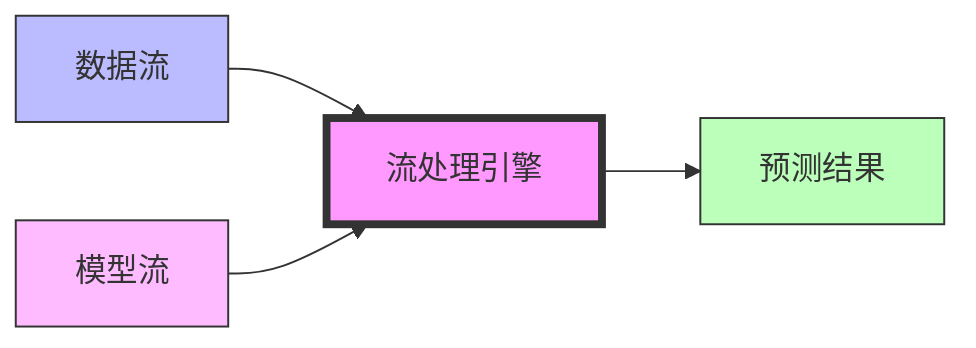
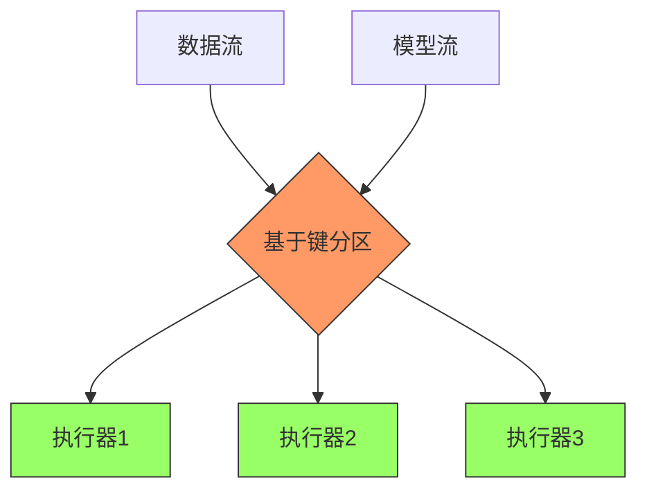
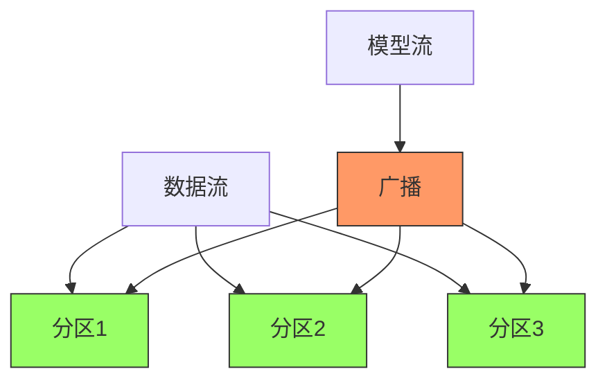
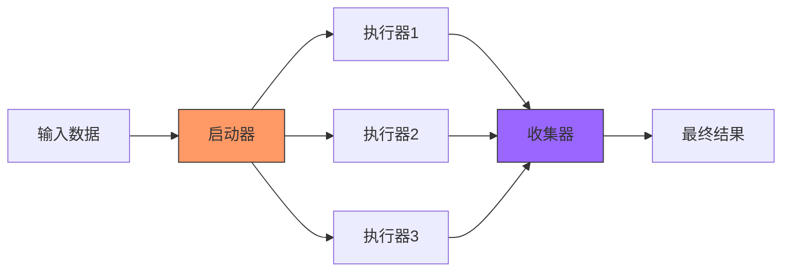

# FLIP-23 统一模型服务平台：一次有趣但被放弃的尝试

## 开篇

想象你是一家餐厅的老板，厨房里有许多大厨，每个人都有自己的独特烹饪手法和秘方（这就像数据科学家用不同的工具训练模型）。现在的问题是：如何把这些独特的菜品标准化，让任何服务员都能准确地把菜品端到客人面前？更重要的是，如何在大厨改进菜品配方时，保证餐厅的服务不会中断？

这就是机器学习领域面临的一个典型问题：数据科学家（就像大厨）使用不同的工具训练模型（创造菜品），而工程师（就像服务员）需要找到一种统一的方式来提供这些模型服务。FLIP-23就是试图解决这个问题的一次尝试，它希望在Flink中提供一个统一的"服务平台"。

## 这个提案想解决什么问题？

现代机器学习应用面临着一系列相互关联的挑战，使得模型部署和管理变得越来越复杂。首当其冲的是工具多样化带来的问题。如今的数据科学家使用TensorFlow、PyTorch、scikit-learn等各种不同的工具来训练模型，这些工具就像不同品牌的厨具，各自都有特定的使用方法。这种多样性迫使工程师不得不学习和维护多套部署系统，大大增加了维护成本和出错风险。

第二个主要挑战是模型更新的问题。在快速发展的机器学习领域，模型需要经常更新来适应新的数据模式和业务需求。这些更新必须无缝进行，就像餐厅更换菜单时不能停止营业一样。当新模型出现问题时，系统还需要能够快速回滚到之前的版本，以维持服务质量。

规模化部署为模型服务带来了另一层复杂性。在物联网场景中，每个设备可能都需要一个独特的模型；在电信行业，不同地区和用户群往往需要不同的模型。这意味着系统需要同时管理和服务成千上万个模型，每个模型都有其独特的存储和加载需求。这个挑战不仅仅是关于处理数量，更重要的是如何高效且可靠地完成这些任务。

最后是监控和管理的复杂性。一个健壮的系统需要实时跟踪每个模型的性能和健康状况，快速发现异常情况，并收集全面的使用统计数据。同时，系统还需要支持便捷的A/B测试，以便有效比较不同模型的表现，确保模型改进真正带来了用户体验的提升。

## 提案的设计思路

让我们来看看这个方案的核心设计思路如何应对这些挑战：

这个设计通过全面的方案巧妙地解决了各个挑战。核心是双流设计，它为模型的发布和部署提供了统一的接口。这个优雅的解决方案允许使用不同工具训练的模型被转换成统一格式，有效解决了工具多样化的问题。系统可以通过模型流进行热更新，无需中断服务，使得模型更新变得无缝而可靠。

内存中的模型设计着重解决了性能和可用性问题。通过将模型保持在内存中，系统避免了频繁加载的开销，实现了快速响应。当新模型到达时，系统在内存中准备好模型并进行平滑切换，确保服务的持续性。这种方法对大规模部署特别有效，因为它只在内存中保留活跃的模型。

针对不同的部署场景，系统提供了两种互补的实现方式。基于键的联结方式擅长高效管理多种不同类型的模型，完美适配规模化部署场景。与此同时，基于分区的联结方式通过并行处理优化了高吞吐量场景，确保在重负载下的最佳性能。

设计中还包含了一个与Flink现有功能无缝集成的全面监控系统。这个系统提供了对模型性能的实时可见性，支持详细的状态查询，并方便进行模型比较的A/B测试，很好地满足了强大的监控和管理需求。

## 技术实现细节

提案设计了两种实现方式：

### 基于键的联结（Key-based Join）

在这种方式中，数据根据键值被路由到特定的执行器。每个执行器负责一组特定的模型，这种方式适合处理多个不同类型的数据和模型。

### 基于分区的联结（Partition-based Join）

在这种方式中，模型被广播到所有执行器，每个执行器处理数据流的一个分区。这种方式适合处理单个模型的高吞吐量场景。

## 推测性执行与投机模型服务

在计算机科学中，推测性执行是一种优化技术。就像一个优秀的象棋选手，总是会提前思考对手可能的几种走法，并为每种情况做好准备。计算机系统中的推测性执行也是这样：它会提前执行一些可能需要的任务，如果真的需要了，就可以立即使用结果；如果最终不需要，就会丢弃结果。

这种技术在处理器设计、内存预读取等领域都有广泛应用。比如现代CPU会猜测程序的下一条指令可能是什么，提前执行它以节省时间；浏览器会预先下载网页中可能会点击的链接，让用户点击后能立即看到内容。在大数据处理领域，Apache Spark将这个概念应用于解决"stragglers"(执行异常缓慢的任务)问题：当发现某个任务的执行速度明显落后于同一阶段的其他任务时，Spark会启动该任务的一个副本，并行执行这两个任务实例，采用先完成的结果。这种容错机制有效地减少了个别慢任务对整体作业完成时间的影响。

基于这种思维方式，提案中提出了一个有趣的设计 - 投机模型服务机制。这个机制采用了一个多模型并行处理的架构：

在这个架构中：
1. **启动器**：负责接收输入数据并将其分发给多个执行器。它会根据配置决定使用哪些模型进行并行处理。

2. **执行器**：每个执行器可以运行不同版本或不同类型的模型：
   - 可以是同一模型的不同版本，用于A/B测试
   - 可以是不同复杂度的模型，平衡精度和速度
   - 可以是不同框架实现的模型，比较性能差异

3. **收集器**：这是系统的关键组件，它的职责包括：
   - 收集所有执行器的结果
   - 根据预定义的策略选择最终结果
   - 记录各个模型的表现数据

这种机制支持多种高级特性：

1. **智能结果选择**：
   - 可以选择置信度最高的结果
   - 可以采用多数投票机制
   - 可以根据模型的历史表现动态调整权重

2. **服务质量保证**：
   - 设置最大等待时间，确保及时返回结果
   - 如果复杂模型未及时返回，可以使用简单模型的结果
   - 支持不同优先级的请求处理

3. **灵活的部署策略**：
   - 支持金丝雀发布：新版本模型初始只处理少量请求
   - 渐进式更新：根据模型表现逐步调整流量比例
   - 快速回滚：当新模型表现不佳时即时切换回旧版本

4. **性能优化与资源利用**：
   - 可以针对不同的硬件优化不同版本的模型
   - 支持模型结果缓存和重用
   - 实现负载均衡，避免资源瓶颈

## 为什么被放弃？

这个FLIP最终被放弃主要有几个原因：

1. **框架范围问题**：模型服务是一个较大的主题，可能更适合作为一个独立的项目而不是Flink的一部分。

2. **技术选择争议**：对于数据序列化方案（ProtoBuf）的使用、监控实现方式等技术细节存在分歧。

3. **维护成本考虑**：支持多种机器学习框架和模型格式会带来较大的维护负担。

4. **生态系统变化**：随着KServe、TensorFlow Serving等专门的模型服务系统的发展，独立的模型服务方案可能更加合适。

## 总结

虽然FLIP-23最终被放弃，但它提出的一些理念和解决方案仍然有其参考价值：

1. 动态更新模型的双流架构设计很好地解决了模型热更新的问题。
2. 投机服务机制为实现高可靠性的模型服务提供了新思路。
3. 基于键的联结和基于分区的联结这两种实现方式分别适应不同的应用场景。

这个FLIP的经历告诉人们，有时候一个好的想法可能因为各种实际原因无法落地，但这个过程中产生的思考和设计仍然能为未来的解决方案提供有益的参考。在当前的机器学习系统生态中，可能使用专门的模型服务系统，再通过Flink与其集成是更务实的选择。
