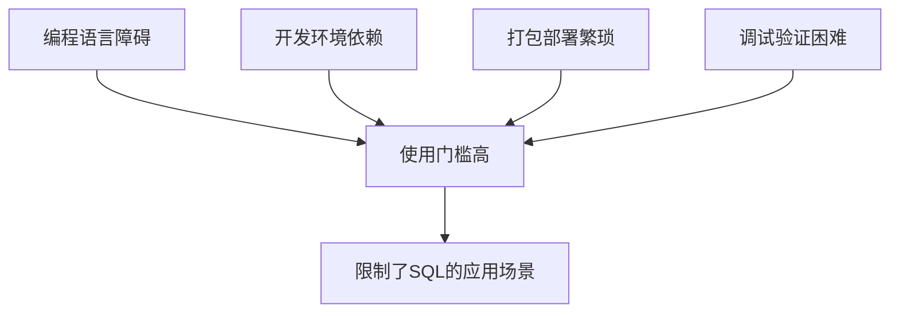
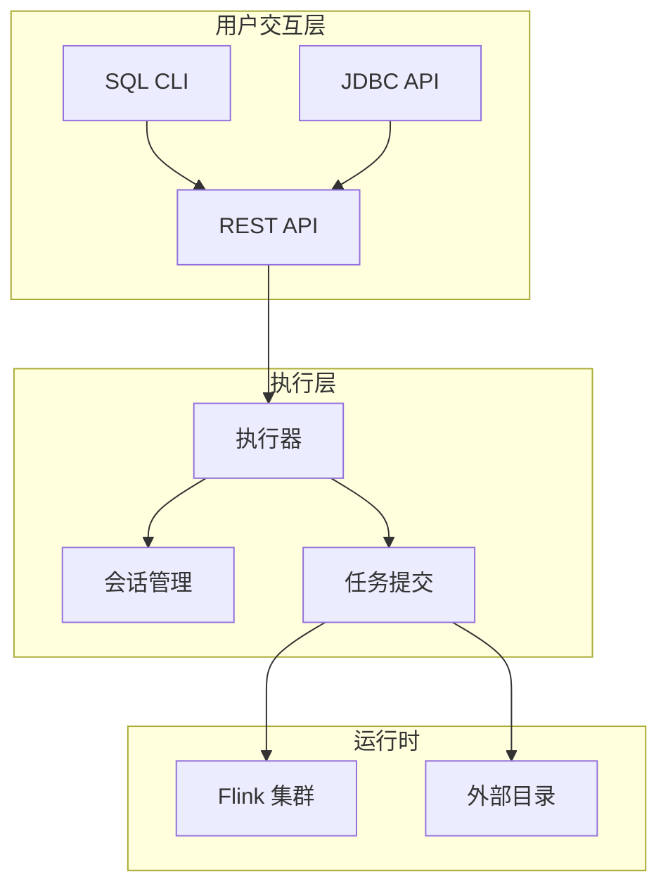

# FLIP-24 让SQL更简单：Flink SQL Client登场

## 开篇

想象一下这样的场景：一位数据分析师想要分析一批实时数据，但他不懂Java或Scala编程。以前，他需要找开发人员帮忙写代码、打包部署，整个过程可能要等好几天。现在有了SQL Client，他可以直接打开命令行，输入SQL语句就能得到结果，整个过程只需要几分钟。这就是FLIP-24带来的改变。

## 为什么需要SQL Client？

在SQL Client出现之前，要使用Flink的SQL功能必须：

1. 编写Java或Scala代码
2. 把SQL语句嵌入到代码中
3. 用Maven打包整个项目
4. 提交到集群运行

这个过程有几个明显的问题：



SQL本应该是一个简单易用的数据查询和分析工具，但这些限制让它变得不那么"平易近人"。特别是对于数据分析师、数据科学家这样的非程序员用户来说，这些门槛严重限制了他们使用Flink的积极性。

## SQL Client 是如何解决这些问题的？

SQL Client采用了两种模式来满足不同场景的需求：

1. 嵌入式模式（Embedded Mode）的设计注重简单快捷。它将SQL CLI与执行器集成在同一个进程中运行，使用户能够快速开始使用，无需额外启动任何组件。这种模式特别适合开发和测试阶段的工作。

2. 网关模式（Gateway Mode）则着眼于生产环境的需求。它通过独立的SQL网关进程提供服务，支持REST和JDBC接口，让多个应用程序能够同时连接使用。这种模式为企业级应用提供了更好的可扩展性和管理能力。

让我们看看它的整体架构：



## 具体实现了哪些功能？

SQL Client的功能设计充分考虑了实际使用场景的需求：

### 1. 配置管理系统
配置管理采用分层设计，支持全局配置和会话配置的组合使用。运行时参数可以灵活调整，而且能够预先注册常用的表源和自定义函数，大大提升了使用效率。

### 2. 查询执行机制
查询执行支持多种模式，既可以执行SELECT查询获取实时结果，也可以通过INSERT语句将数据写入外部系统。系统能够同时处理批处理和流处理任务，满足不同场景的需求。

### 3. 结果处理
SQL Client不仅提供了多种结果处理模式，还实现了智能的结果维护机制。

首先是三种基本的结果处理模式：

| 模式 | 适用场景 | 特点 |
|------|---------|------|
| 内部模式 | 小规果集 | 直接在内存中处理 |
| 外部模式 | 大结果集 | 写入外部存储系统 |
| 自定义模式 | 特殊需求 | 用户自定义输出方式 |

对于流式查询结果的维护，SQL Client提供了两种特殊的视图机制：

1. 物化视图（Materialized View）


物化视图主要用于长期运行的生产环境查询。它基于Flink的检查点机制定期更新结果，并在更新过程中保持数据一致性。更新时产生的中间回撤操作对外部系统来说是不可见的，这样可以确保数据的稳定性。外部系统可以通过JDBC或REST API访问这些结果，查询时总能得到一个完整的数据快照。物化视图的更新策略是可配置的，而且它的生命周期完全独立于CLI客户端，这意味着即使客户端断开连接，视图依然会继续维护。

2. 物化结果流（Materialized Result Stream）


物化结果流则专注于开发和调试场景。它实时展示数据的变化，包括新数据的插入和已有数据的更新。所有变更都按照先进先出（FIFO）的顺序呈现，让开发人员能够直观地了解数据的演变过程。这种模式与CLI会话紧密绑定，当会话结束时，相应的结果流也会自动停止，从而有效管理系统资源。

这两种机制的设计理念各有侧重：物化视图注重数据的一致性和可用性，适合构建面向最终用户的应用；物化结果流则强调即时性和可见性，更适合开发过程中的调试和验证。通过这样的区分，SQL Client能够在不同场景下都提供最适合的结果处理方式。

### 4.实际使用案例

下面通过一个具体的案例来展示SQL Client的使用流程：

1. 首先启动SQL Client：
```bash
./bin/sql-client.sh
```

2. 然后配置数据源：
```sql
CREATE TABLE orders (
    order_id BIGINT,
    price DECIMAL(32,2),
    order_time TIMESTAMP(3)
) WITH (
    'connector' = 'kafka',
    'topic' = 'orders',
    'properties.bootstrap.servers' = 'localhost:9092',
    'format' = 'json'
);
```

3. 接着就可以执行查询：
```sql
SELECT 
    TUMBLE_START(order_time, INTERVAL '5' MINUTE) as window_start,
    COUNT(*) as order_count,
    SUM(price) as total_amount
FROM orders
GROUP BY TUMBLE(order_time, INTERVAL '5' MINUTE);
```

## 版本支持情况

SQL Client从Flink 1.5版本开始引入，经过多个版本的演进不断完善：

Flink 1.5首次引入时的核心功能包括基础的SQL CLI界面、流式查询支持和简单的结果显示功能。随后的版本不断增加新特性：Flink 1.6增加了批处理支持；1.7版本引入了用户自定义函数支持；1.8版本改进了结果展示机制；到了1.9版本，又加入了会话管理的能力；在1.17版本中，引入了物化机制的支持，包括物化视图和物化结果流两种形式，提供了更加灵活的结果处理方式。这种渐进式的功能演进确保了系统的稳定性和可用性。

## 总结

SQL Client通过简化开发流程，成功降低了使用Flink SQL的门槛。它消除了编程语言的限制，简化了开发部署流程，让更多人能够利用Flink强大的流处理能力。无论是进行数据探索、原型验证，还是构建生产级应用，SQL Client都提供了一种简单而强大的方式。

从架构设计上看，SQL Client采用了灵活的双模式设计，既能满足单机开发测试的需求，又能支持企业级的多用户访问。结合Flink的批流统一特性，它为各类数据处理场景提供了统一的SQL接口，真正实现了"写一次SQL，到处运行"的目标。

特别值得一提的是SQL Client的两种物化机制设计。物化视图专注于生产环境，通过检查点机制保证数据一致性，支持外部系统稳定访问，生命周期独立于客户端；而物化结果流则针对开发调试场景，实时展示数据变更，包括更新和回撤操作，帮助开发者直观理解数据流转过程。这两种机制的巧妙结合，让SQL Client能够同时满足生产环境的稳定性需求和开发环境的即时性需求。
