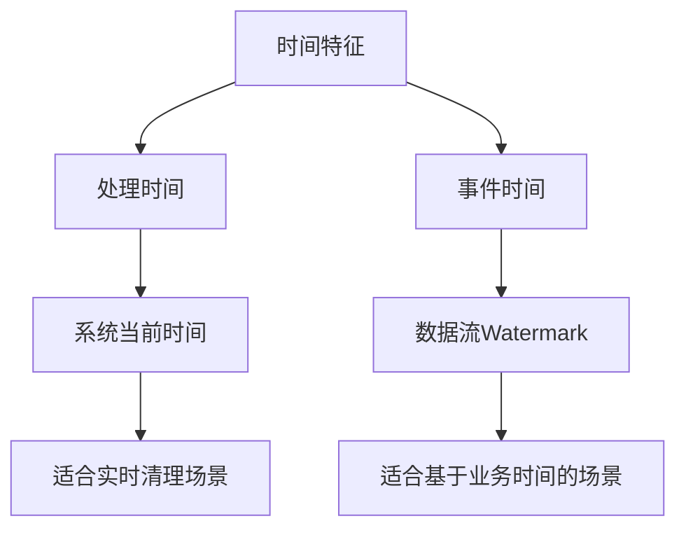
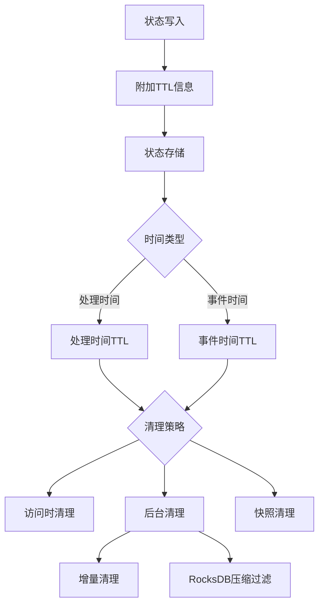

# FLIP-25: 让状态数据自动过期：Flink状态TTL机制

## 开篇

你有没有遇到过这样的情况：手机相册里的照片越来越多，占用的空间也越来越大，但很多照片已经过时了，希望能自动清理掉旧照片。Flink中的状态管理就像这个数字相册 - 状态数据会不断累积，如何优雅地处理过期数据成为一个重要话题。FLIP-25就像是为你的数据相册安装了一个智能管理系统，能够自动识别并清理那些"过期照片"。

## 为什么需要状态TTL?

在讨论具体方案之前，我们先来看看为什么需要状态TTL(Time-To-Live，生存时间)机制:

1. 防止相册爆满
就像手机存储空间有限一样，Flink的状态存储也有容量限制。在某些场景下，如网站访客分析，每个访客就像一张新照片，都会产生状态数据。如果这些"照片"永远不被删除（访客永远不返回），相册就会越来越满，最终无法存储新照片。

2. 满足照片隐私规定
就像某些隐私法规要求不能长期保存他人照片一样，欧盟GDPR等隐私法规要求个人数据只能在限定时间内保存。状态TTL就像是照片的"自动过期标签"，确保数据不会超期存储。

3. 提升相册运行效率
一个塞满无用旧照片的相册运行缓慢。通过及时清理"过期照片"（不再需要的状态数据），可以释放空间，让数据处理系统运行得更快、更高效。

## 支持的时间特征

想象你在整理数字相册，判断照片是否该清理有两种方式：看当前日期和看照片的拍摄日期。Flink的TTL机制也是类似的道理:



该方案支持两种时间特征:

1. 处理时间(Processing Time)
- 就像看手机当前日期一样简单
- 配置方便，拿来就能用
- 特别适合"立刻要知道照片是否该清理"的场景

2. 事件时间(Event Time)
- 根据照片本身的拍摄时间戳来判断
- 需要设置好Watermark(水位线)机制
- 适合按照照片实际产生时间来管理数据的场景

## 具体方案是什么?

想象一下，每个状态数据就像是一张带有"过期日期"标签的照片:



FLIP-25的设计就像一个智能相册管理系统:

### 1. TTL配置
就像设置照片的保留规则:
- TTL时长: 照片能保存多久
- 更新类型: 是否在查看照片时刷新保留期
- 状态可见性: 过期照片是否还能被查看
- 时间类型: 用当前时间还是照片拍摄时间判断过期
- 清理策略: 如何处理过期照片

### 2. 数据结构设计
每张"照片"都带有时间戳标记:
```java
class TtlValue<T> {
    T value;           // 实际状态值（照片内容）
    long lastAccess;   // 最后访问时间（类似于照片的时间戳）
}
```

### 3. 清理策略
就像智能相册清理旧照片一样，有多种方式:

#### 常规清理
- 访问时清理: 浏览相册时发现过期照片就删除
- 全量备份清理: 在备份相册时过滤掉过期照片

#### 后台清理
- 增量清理: 定期检查相册中的一部分照片
- RocksDB压缩过滤: 在相册优化整理时顺便清理过期照片

## 使用示例

用代码来说就是这样:

```java
// 配置TTL，就像设置照片自动清理规则
StateTtlConfig ttlConfig = StateTtlConfig
    .newBuilder(Time.days(1))    // 照片保存1天
    .setUpdateType(UpdateType.OnCreateAndWrite)    // 查看照片时更新时间戳
    .setStateVisibility(StateVisibility.NeverReturnExpired)  // 过期照片不可见
    .cleanupFullSnapshot()       // 备份时清理过期照片
    .setTtlTimeCharacteristic(TtlTimeCharacteristic.ProcessingTime) // 用当前时间判断
    .build();

// 创建状态描述符并启用TTL
ValueStateDescriptor<String> descriptor = 
    new ValueStateDescriptor<>("myState",`String.class);
descriptor.enableTimeToLive(ttlConfig);  // 打开自动清理功能
```

如果想用照片的拍摄时间来判断过期，只需要改一下配置:

```java
StateTtlConfig ttlConfig = StateTtlConfig
    .newBuilder(Time.days(1))
    .setTtlTimeCharacteristic(TtlTimeCharacteristic.EventTime)
    .build();
```

## 重要注意事项

1. 关于过期时间
- 数据一定会活到过期时间: 就像设定保留期内的照片一定可以查看
- 不一定立即清理: 过期照片可能不会马上被删除

2. 内存使用
- 每张"照片"都要记录时间戳: 会多用一点内存
- 后台清理也要资源: 清理过程也需要一些计算能力

3. 性能考虑
- 清理会占用一些资源: 就像整理相册需要时间和精力
- RocksDB有专门优化: 大量照片时清理效率更高
- 根据实际情况选择: 不同场景选不同的清理方式

## 实现状态

这个智能相册功能是这样一步步完善的:

* 1.6: 基础照片过期功能(基于当前时间)
* 1.8: 大型相册优化支持(RocksDB压缩过滤器)
* 1.9: 增量清理机制优化(更智能的后台清理)
* 1.13: 基于照片拍摄时间的过期支持(事件时间TTL)

## 总结

状态TTL就是帮我们解决"数据太多怎么办"的问题。就像智能相册会自动清理旧照片一样，有了这个功能，你再也不用担心状态数据会越攒越多。Flink会在背后默默帮你处理好一切，让你的应用运行得更轻松、更高效，就像一个永远不会存满的智能相册，总是为新数据保留着足够的空间。
