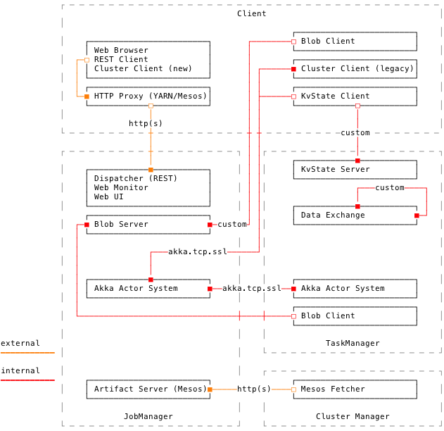
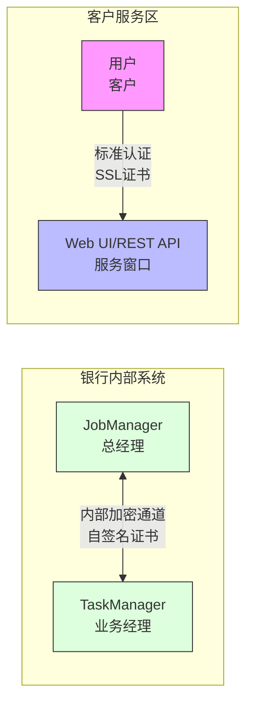

# FLIP-26：银行没有安保措施怎么行：Flink 的安全提升方案

## 开篇

想象你走进一家银行，却发现这家银行没有任何安保措施 - 没有保安，没有监控摄像头，甚至连保险柜都没有锁。任何人都可以随意进出金库，查看客户账户信息，甚至可以拿走现金或者替换成假钞。听起来难以置信对吧？这就是早期 Flink 的处境 - 它就像一家没有安保系统的银行，完全依靠"隐蔽性"来保护自己的资产（数据）。

FLIP-26 就像是为这家银行设计一套全方位的安保系统。不仅要在每个出入口安装安全门禁，还要实现双向认证机制 - 就像银行不仅要验证客户的身份证，客户也应该能确认对方确实是合法的银行工作人员。这种"互相认证"的安全机制可以应用于 Flink 的各种部署模式，无论是单机版的小型网点，还是分布式集群的大型银行（如 Kubernetes、YARN 和 Mesos 环境）。



## 银行安保系统的设计方案

### 两种安全交互场景

想象 Flink 是一家拥有完整业务体系的银行，这家银行有两种不同的安全交互场景：

1. **内部金库通道**：这就像银行内部工作人员之间传递现金和重要文件的专用通道。这些通道使用特制的安全钥匙和员工卡互相验证身份（对应 JobManager 和 TaskManager 之间的内部通信）。每个工作人员都有自己的安全凭证，确保只有授权人员才能在内部系统间传递信息。

2. **客户服务窗口**：这就像银行的对外服务柜台和自助终端，供客户查询账户和办理业务（对应 Flink 的 Web UI 和 REST API）。这些窗口需要更加标准化的身份验证机制，既要方便客户使用，又要确保安全。



### 银行身份认证系统

就像每家银行都有自己的安全认证体系，Flink 的每个部署实例也需要自己的身份认证机制：

- **内部员工认证**：银行内部员工使用专门的工牌和密码（对应 Flink 内部组件使用的自签名证书）。这些证书就像银行内部定制的安全卡，只在内部系统间使用，无需外部机构认证，但能确保内部通信安全。

- **客户服务认证**：对外服务窗口使用国家认可的标准身份验证系统（对应外部认证的 SSL/TLS 证书）。这些证书就像由金融监管机构颁发的营业执照，让客户能够确认这确实是一家合法的银行。

### 密钥管理体系

银行的密钥管理就像是一套精密的保险柜钥匙系统：

- **内部密钥**：只在银行内部使用的特制钥匙（自签名证书），由银行自己生成和管理，外人无法复制。这些密钥用于保护内部金库和员工之间的通信，就像 JobManager 和 TaskManager 之间的加密通道。

- **对外密钥**：标准化的客户服务密钥（公共认证的证书），符合行业标准，可以被客户的设备（如网银软件）识别和验证。这些密钥确保客户能安全地连接到银行的服务窗口，就像用户访问 Flink 的 Web UI 和 REST API。

### 不同分行的安全策略

根据银行分支机构的类型和规模，安全策略也各不相同：

| 分行类型 | 直接服务模式 | 代理服务模式 |
|---------|------------|------------|
| 现代化智能分行(K8s) | 使用分行自己的安全门禁系统<br>（K8s 原生安全机制） | 通过总行预约系统访问<br>（K8s API 服务器代理） |
| 标准综合分行(YARN) | 双重身份验证系统<br>（YARN 安全认证 + Flink 认证） | 通过前台统一服务平台<br>（YARN AM 代理） |
| 合作特许分行(Mesos) | 双重身份验证系统<br>（Mesos 认证 + Flink 认证） | 通过合作方介绍服务<br>（Mesos 代理） |
| 独立社区网点<br>（单机部署） | 本地双重身份验证<br>（本地证书 + 密码） | 不提供代理服务<br>（仅直接访问） |

这个表格就像是不同类型银行分支机构的安保方案对比。现代化智能分行（K8s 环境）使用最先进的安保系统，而社区网点（单机部署）则采用相对简单但同样有效的安保措施。

## 银行安保系统的建设进展

### 本方案的现状和未来

在 Flink 现有安全体系的基础上，这套银行级安保方案原本计划通过 Akka 通信层（相当于银行的核心安保系统）来实现更完善的安全机制，目前在社区处于讨论阶段。但由于 Flink 从 1.16 版本开始已经移除了对 Akka 的依赖（就像银行更换了核心安保供应商），这个基于 Akka 的具体实现方案将不会继续推进。不过，这些安全需求在 Flink 的新架构中依然存在，需要用其他技术方案来解决（就像银行仍然需要安保系统，只是换了供应商）。

值得一提的是，Flink 早期确实存在严重的安全漏洞，例如 CVE-2020-17519 未授权访问漏洞，就像银行的金库门被发现有设计缺陷，任何人都可能绕过前台直接进入金库区域。这些真实发生的安全事件更加凸显了完善安全机制的必要性。

让我们回顾一下这些年 Flink 的安全体系是如何一步步完善的。就像一家银行从最初只有基础门锁，逐步升级到全方位的现代化安保系统：

### Flink 安全体系的演进历程

#### 1. 身份认证系统的建立与完善

- **1.4 版本**：引入 Kerberos 认证，这就像银行引入了统一的客户身份识别系统。无论你去哪个网点，都能通过同一张身份证被识别出来。Kerberos 让 Flink 能够在大数据生态系统中安全地验证用户和服务的身份。

- **1.7 版本**：增加了 Security Cookie 认证机制，这就像银行内部员工的智能工牌系统。每个员工的工牌都有独特的加密芯片，确保只有真正的银行员工才能进入内部区域。同样，Security Cookie 确保了 Flink 内部组件之间的通信安全，防止未授权的组件冒充合法组件。

#### 2. 数据传输加密系统

- **1.5 版本**：实现了 SSL/TLS 加密传输机制，这就像银行在运钞车上安装了防弹装甲和GPS追踪系统。即使有人拦截了运钞车（数据传输），也无法打开装甲车或者知道里面装的是什么。SSL/TLS 加密确保了 Flink 组件之间传输的数据即使被截获也无法被解读。

- **1.10 版本**：优化了加密配置方式，提供了更细粒度的加密控制选项。这就像银行升级了安保系统，可以针对不同价值的物品设置不同级别的保护措施，既保证安全又节约成本。

#### 3. 高可用模式下的访问控制

- **1.6 版本**：在高可用模式下实现了基于 ZooKeeper 的 ACL 访问控制。这就像银行的贵宾室访问系统 - 不是所有客户都能进入，需要特定的会员卡和权限。配置示例：
  ```yaml
  high-availability.zookeeper.client.acl: creator  # 只有创建者才有完全访问权限
  zookeeper.sasl.disable: false  # 启用安全认证
  ```
  
  这些配置就像是设置银行贵宾室的门禁规则，确保只有授权人员才能访问高可用模式下的关键资源。

#### 4. Web 管理界面的安全加固

- **1.9 版本**：实现了基于白名单的访问控制系统。这就像银行的网上银行系统只允许来自可信设备的登录请求，陌生设备需要额外验证。Flink 的 Web UI 也通过白名单机制，只允许特定 IP 地址的访问请求。

- **1.11 版本**：增加了 Security Headers 支持，优化了 XSS 防护机制。这就像银行网银系统增加了防钓鱼和防病毒的高级功能，即使黑客尝试注入恶意代码，也会被安全系统拦截。

#### 5. 模块化安全架构

- **1.10 版本**：正式引入了可插拔的安全模块机制。这就像银行可以根据不同分行的需求，选择不同的安保供应商和系统，但都能无缝集成到总行的安保标准中。值得注意的是，Hadoop 集成安全模块早在此之前就已存在，但 1.10 版本将整个安全架构模块化，使其更加灵活。配置示例：
  ```yaml
  security.context.factory.classes: org.apache.flink.runtime.security.contexts.HadoopSecurityContextFactory
  security.module.factory.classes: org.apache.flink.runtime.security.modules.HadoopModuleFactory
  ```
  
  这些配置就像是银行选择特定的安保系统供应商，Flink 可以根据部署环境选择最合适的安全模块，如与 Hadoop 生态系统集成的安全模块。

- #### 一目了然的安全功能演进表

| **安全功能** | **版本里程碑** | **解决的安全问题** | **银行安保对应物** |
|------------|--------------|-----------------|-----------------|
| Kerberos 认证 | 1.4+ | 统一身份认证，主要用于大数据平台 | 全国通用的身份证系统 |
| SSL/TLS 加密 | 1.5+ | 数据传输加密，防止信息泄露 | 装甲运钞车和保密文件箱 |
| ZooKeeper ACL | 1.6+ | 控制谁能访问关键资源，用于高可用模式 | 贵宾室和金库访问控制 |
| Cookie 认证 | 1.7+ | 系统内部组件互相认证，防止被冒充 | 员工智能工牌系统 |
| Web UI 安全 | 1.9+ | 保护管理界面，防止未授权访问 | 网银安全系统和防钓鱼机制 |
| 安全插件机制 | 1.10+ | 可以接入自定义安全系统 | 可定制的分行安保解决方案 |

这张表格就像是银行安保系统的升级历程。从最基础的门禁卡（Kerberos 认证），到全方位的现代化安保系统（可插拔安全模块），Flink 的安全体系越来越完善，能够满足从小型社区银行到大型跨国银行（从单机部署到大规模集群）的各种安全需求。


## 总结

这个安全方案就像是为一家快速发展的银行设计的全方位安保系统。虽然由于银行更换了核心技术供应商（Flink 移除了 Akka 依赖）而可能不会按原计划实施，但它提出的核心安保理念依然值得借鉴：

1. **全面的身份认证**：就像银行需要确认每位员工和客户的身份一样，Flink 系统内部需要一套严格的组件身份认证机制。

2. **灵活的客户服务**：不同的客户有不同的需求，银行需要支持多种服务方式，同样 Flink 的对外接口也要支持多样化的认证方式。

3. **生态系统兼容**：现代银行需要与其他金融机构和支付系统无缝对接，Flink 的安全机制也需要考虑与大数据生态系统中其他组件的互操作性。

这个方案的设计思路 - 在安全性与易用性之间寻找平衡点 - 就像现代银行既要保证资金安全，又要提供便捷服务一样。尽管具体实现方式会随着技术架构的变化而调整，但安全性和易用性的平衡始终是系统设计中需要考虑的关键因素，就像银行永远需要在严密的安保和友好的客户体验之间找到最佳平衡点。
