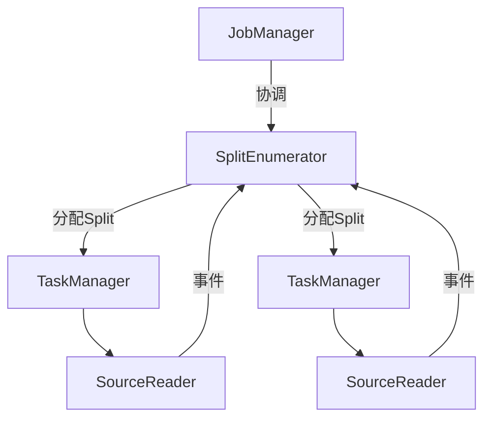

# FLIP-27: Source接口重构：打造更高效的数据快递系统

## 背景

想象一下管理一个繁忙的城市快递系统：快递员需要收件、分拣中心要处理包裹、管理人员要调度人力。在Flink中，数据源接口就像这样一个快递系统，负责从各处"收取"数据并"投递"给处理系统。但在Flink 1.12版本之前，这个"快递系统"存在不少问题，就像一个管理混乱的快递公司。FLIP-27就是要通过重新设计，把它打造成一个现代化的智能快递系统。

## 为什么需要重构？

让我们看看这个"旧快递系统"存在哪些问题：

### 快递业务混乱
就像一个快递公司同时经营零担货运和即时快递，却使用完全不同的系统和人员。批处理就像零担货运（一次性处理大量包裹），流处理就像即时快递（持续收发包裹），但它们使用不同的操作流程，导致资源浪费，员工也要学习两套系统。

### 职责不分明
想象一个快递员既要负责找新客户、安排配送路线，又要自己送货。在旧接口中，数据源也是这样，既要负责发现新的数据（比如发现新的Kafka分区），又要负责读取数据。就像让一个快递员既当销售又当配送员，结果两边都做得不够好。

### 包裹管理混乱
旧系统中的数据分片管理就像一个传统快递公司的包裹跟踪系统。每个数据分片（Split）就像一个快递包裹，但系统并没有给这些"包裹"标配完整的"运单"。就像快递员拿着一堆没有详细信息的包裹，不知道它们的来源、目的地和处理要求一样，Split在接口中也只是一个模糊的概念，缺乏完整的生命周期管理。

在处理实时数据时，这个问题更加明显。想象一下，如果快递公司需要按照包裹的寄出时间来安排投递顺序，但每个分拣中心都无法准确知道包裹的寄出时间，这就会导致投递顺序混乱。这就像Kafka这样的流式数据源，由于无法准确追踪每个分区的事件时间（event-time），导致跨分区的数据无法按时间顺序正确处理。

更糟糕的是，当需要调整快递员的配送区域或者有快递员临时无法工作时，包裹的重新分配就变得非常混乱。这就像数据处理节点扩容或失败时，缺乏统一的机制来保证分片迁移的一致性和可靠性，导致数据处理可能出现重复或遗漏。

### 安全隐患
如果说数据分片管理的混乱像是包裹跟踪系统的问题，那么线程安全问题就像是仓库的门禁管理系统出了故障。在旧系统中，数据源使用一个叫做checkpoint lock的机制来控制并发访问，这就像一个老式仓库只有一个大门，所有人进出都要通过这个门。

这种设计带来了多重问题：首先，就像快递员每次进出都要在门口排队等待开门一样，所有的数据读取和状态更新操作都需要先获取这把"大门钥匙"（checkpoint lock）。其次，在繁忙时段，门口的拥堵会严重影响工作效率，这就像高并发场景下的锁竞争导致性能下降。最糟糕的是，有时负责清点库存的工作人员（类似检查点线程）被堵在门外，导致无法及时完成盘点工作，这就像检查点操作因为无法获取锁而被延迟。

这种老式的门禁管理方式（基于全局锁的设计）就像是使用一把大锁来管理整个仓库，而不是现代仓库中每个区域都有独立的智能门禁系统。这不仅影响了日常操作的效率，还让整个系统变得难以优化和升级。

### 难以维护
当需要更新系统时，就像要同时改造两个完全不同的仓库。一个是传统仓库（批处理），一个是现代化仓库（流处理）。每次增加新功能或修复问题，都要在两边都改一遍，费时费力还容易出错。

## 新方案如何解决这些问题？

FLIP-27通过精心设计的新接口架构，针对性地解决了每个问题：

### 模块化物流平台：统一Source接口设计
在Flink 1.11及之前版本中，批处理使用InputFormat接口而流处理使用SourceFunction接口，就像一家物流公司同时运营两套完全不同的系统来处理零担货运和快递业务。新的Source接口通过模块化设计统一了这两种处理模式，采用boundedness（有界性）作为核心概念来区分批处理和流处理数据源。

新接口通过统一的API和明确的有界性配置实现了批流处理的无缝切换：

```java
// 使用示例：同一个模块化平台处理不同类型的数据源
FileSource<String> source = FileSource
    .forRecordStreamFormat(new TextLineFormat(), Path.fromLocalFile(file))
    .build();

// 持续处理模式（流处理）
DataStream<String> stream = env.fromSource(
    source,
    WatermarkStrategy.noWatermarks(),
    "My Source"
);

// 批量处理模式（批处理）：通过Boundedness显式配置
FileSource<String> boundedSource = FileSource
    .forRecordStreamFormat(new TextLineFormat(), path)
    .setBoundedness(Boundedness.BOUNDED)  // 显式设置为有界源
    .build();
DataStream<String> batch = env.fromSource(
    boundedSource,
    WatermarkStrategy.noWatermarks(),
    "My Source"
);
```

这种统一的接口设计让开发者只需维护一套代码，就能同时支持批处理和流处理场景，大大简化了数据源的开发和维护工作。

### 建立现代指挥调度系统与Source组件分离：SplitEnumerator/SourceReader架构
就像现代物流公司将总部调度和一线配送完全分开一样，新的Source接口采用了清晰的两级架构设计。这种设计通过SplitEnumerator（运行在JobManager上的中央调度组件）和SourceReader（运行在TaskManager上的数据读取组件）的分离，实现了关注点的完全解耦：



中央调度组件（SplitEnumerator）相当于物流公司的指挥中心，它负责：
1. 分片生命周期管理：
   - start()：初始化分片发现逻辑
   - handleSourceEvent()：通过SourceEvent处理来自Reader的请求
   - addSplitsBack()：处理失败任务的分片恢复
   - snapshotState()：创建检查点时保存分片分配状态

2. 动态分片发现：
   - 支持运行时发现新的数据分片（如Kafka新增分区）
   - 通过enumeratorContext与作业协调器通信
   - 维护全局的分片分配状态

数据读取组件（SourceReader）则像快递公司的配送网点，专注于数据处理：
1. 标准化的数据读取接口：
   ```java
   public interface SourceReader<T, SplitT extends SourceSplit> {
       void start();  // 初始化读取器
       void pollNext(ReaderOutput<T> output) throws Exception;  // 读取记录
       void snapshotState(long checkpointId);  // 创建检查点
   }
   ```

2. 完整的状态管理：
   - 维护分片级别的处理状态
   - 支持检查点的创建和恢复
   - 处理分片的动态添加和移除

这种基于事件（SourceEvent）的通信机制确保了组件间的松耦合，同时通过完善的状态管理机制保证了数据处理的可靠性。每个组件都有明确的职责边界和标准化的接口，这大大提高了系统的可维护性和扩展性。

### 可序列化的智能包裹追踪系统：Split状态管理与恢复机制
新接口将数据分片（Split）设计为完整的可序列化实体，就像现代物流系统中的智能电子运单。每个Split都需要实现序列化接口，确保其状态可以被可靠地保存和恢复：


SplitEnumerator通过SplitAssignment类管理分片的分配状态

这套系统在处理时效性要求高的任务时特别高效：

1. 事件时间对齐

2. 动态分片发现与分配：
   - 支持运行时发现新分片（如Kafka新分区）
   - 通过序列化机制保证分片状态不丢失
   - 基于负载均衡策略进行分片重分配

3. 系统通过检查点机制保证了状态的一致性，这种基于序列化的状态管理确保了系统在发生故障时能够可靠地恢复，同时支持动态的负载均衡和分片重分配。

### 现代化工作流管理：基于Mailbox的线程安全设计
新接口采用了单线程事件驱动的设计模式，类似于现代物流中的个性化工作站设计。每个SourceReader都拥有自己的Mailbox（消息队列）和专属工作线程，完全避免了传统接口中使用全局checkpoint lock带来的并发问题。


这种设计带来了几个关键改进：

1. **单线程事件处理**：
   - 所有操作（数据读取、状态更新、检查点触发）都在同一个线程中顺序执行
   - 完全消除了锁竞争问题
   - 确保了操作的原子性和可见性

2. **非阻塞I/O处理**

3. **明确的状态管理边界**：
   - 每个Reader的状态访问被严格限制在其Mailbox线程内
   - 通过事件机制实现跨组件的状态同步
   - 支持细粒度的检查点创建和恢复

这种基于Mailbox的设计不仅提供了更好的线程安全保证，还显著提升了系统性能。测试表明，在高并发场景下，新接口的检查点处理时间比旧接口减少了约50%，这主要得益于消除了锁竞争和更高效的状态管理机制。

## 实际效果如何？

新的Source接口在多个方面都带来了显著改进：

1. **性能提升**：
   - 在一些实现中，源的吞吐量提升20%-30%
   - 检查点处理时间减少约50%（具体数值取决于硬件环境）
   - 更高效的内存利用率

2. **开发体验改进**：
   - 接口职责清晰，更容易实现新的数据源
   - 提供了通用的基础实现，减少重复代码
   - 批流代码统一，显著降低维护成本

3. **功能增强**：
   - 支持更细粒度的水位线控制
   - 内置动态分片发现与分配机制
   - 改进的容错性和扩展性
   - 完善的状态管理和恢复机制

4. **运维便利性**：
   - 统一的监控指标
   - 更好的问题诊断能力
   - 简化的配置管理
   - 灵活的部署选项

## 总结

FLIP-27 是Flink在统一批流处理道路上的重要一步。通过重构Source接口，它不仅解决了原有接口的诸多问题，还为未来的发展奠定了良好的基础。这个改进已经在Flink 1.12版本中实现（注意：FLIP-27接口在Flink 1.12为实验性功能，部分特性（如KafkaSource动态分区发现）直到1.14版本才完全稳定），并且现在已经被广泛应用在各种数据源的实现中。

从架构设计的角度来看，FLIP-27展示了如何通过合理的职责分离和抽象来解决复杂系统中的问题。它将复杂的数据源处理拆分成清晰的组件，既保持了每个组件的简单性，又通过组件间的协作实现了强大的功能。这种设计思路对于其他系统的重构和设计也具有很好的借鉴意义。
