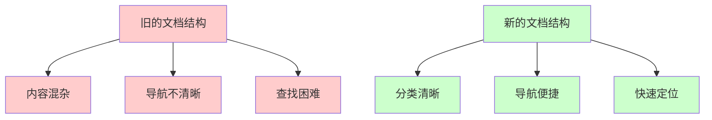
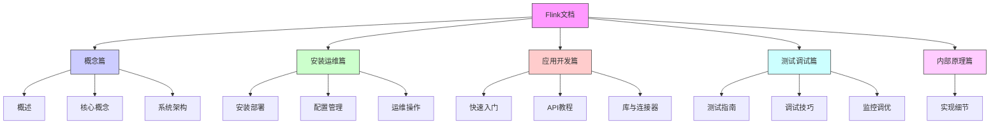

# FLIP-3 让文档更好找：Flink 文档的重新组织

## 开篇

你是否有过这样的经历：在图书馆找一本书，但是分类太乱了，找了半天都找不到。或者是在一个大型超市里购物，商品摆放杂乱无章，让你转了好几圈都没找到想要的东西。这种体验是不是很糟糕？

Flink的文档就曾经面临类似的问题。随着内容越来越多，用户常常找不到他们需要的信息。这就好比一个装满了好东西但是杂乱无章的百宝箱，虽然里面有很多宝贝，但就是不容易找到你想要的那个。FLIP-3就是为了解决这个问题而提出的。

让我们先看看这次整理的效果：

## 为什么要重组文档？

### 找东西太费劲

想象一下，你走进一个没有任何分类标签的图书馆，所有的书都随意地摆放在书架上。这时候你要找一本特定的书，除非你把每个书架都看一遍，否则很难找到。Flink的文档就面临着类似的问题：

1. 内容虽多，但分类不够清晰
2. 重要的文档藏得太深
3. 用户不知道从哪里开始找起

### 导航不够直观

就像一个城市需要清晰的路标系统一样，文档也需要好的导航。当时的问题是：

1. 顶层菜单太少，很多重要内容被深埋在子菜单中
2. 用户经常需要点击多次才能找到想要的信息
3. 相关的内容散落在不同的地方

## FLIP-3 怎么解决这些问题？

这个改进方案就像是给图书馆做了一次大扫除，不仅整理了书籍，还加上了清晰的分类标签。具体来说，把所有文档分成了五大类：

让我们用一个图来直观地看看这个新的组织结构：

### 1. 概念篇：打好基础

就像学习一门新语言首先要了解基本语法一样，这部分包含了：
- 系统概述：让你快速了解Flink是什么
- 核心概念：解释重要的基础概念
- 系统架构：介绍整体结构
- 项目结构：帮你理解各个组件的关系

### 2. 安装运维篇：从0到1搭建系统

这就像是一本详细的装机指南，包括：
- 下载和安装步骤
- 各种部署方式的说明
- 配置指南
- 安全设置
- 运维操作指导

### 3. 应用开发篇：动手写代码

这部分就像是一本实战教程，包含：
- 快速入门指南
- 详细的API文档
- 各种功能的使用说明
- 数据类型指南
- 连接器使用说明

### 4. 测试调试篇：确保代码质量

这就像是一本疑难解答手册，告诉你：
- 如何编写测试
- 如何调试问题
- 如何监控系统
- 如何优化性能

### 5. 内部原理篇：深入理解系统

对于想要深入了解系统的人来说，这部分解释了Flink是如何工作的。

## 这么做带来了什么好处？

这次重组就像是把一个杂乱的储物间变成了一个井井有条的储物系统：

1. 找东西更快了：你知道应该去哪个区域找什么内容
2. 新手更友好：清晰的结构让初学者知道从哪里开始
3. 内容更完整：通过合理的分类，也能发现哪些文档是缺失的
4. 维护更容易：编写新文档时，很容易知道应该放在哪里

## 总结

就像整理房间一样，好的组织方式能让生活更轻松。FLIP-3通过重新组织文档结构，让Flink的文档变得更加清晰、易用。无论你是初学者还是经验丰富的开发者，都能更快地找到需要的信息。

这次改进告诉我们：有时候"做减法"（简化结构）比"做加法"（增加内容）更重要。一个好的文档系统，不仅要有足够的内容，更要有清晰的组织结构，让用户能够轻松地获取他们需要的信息。
