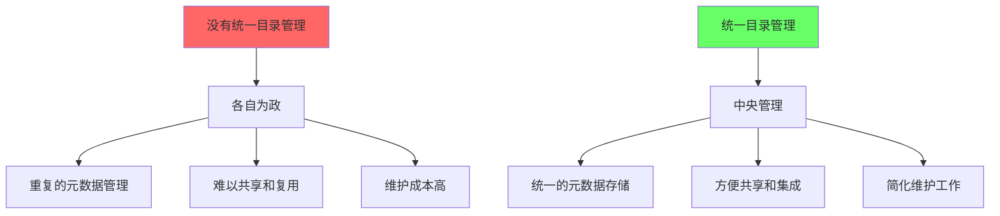
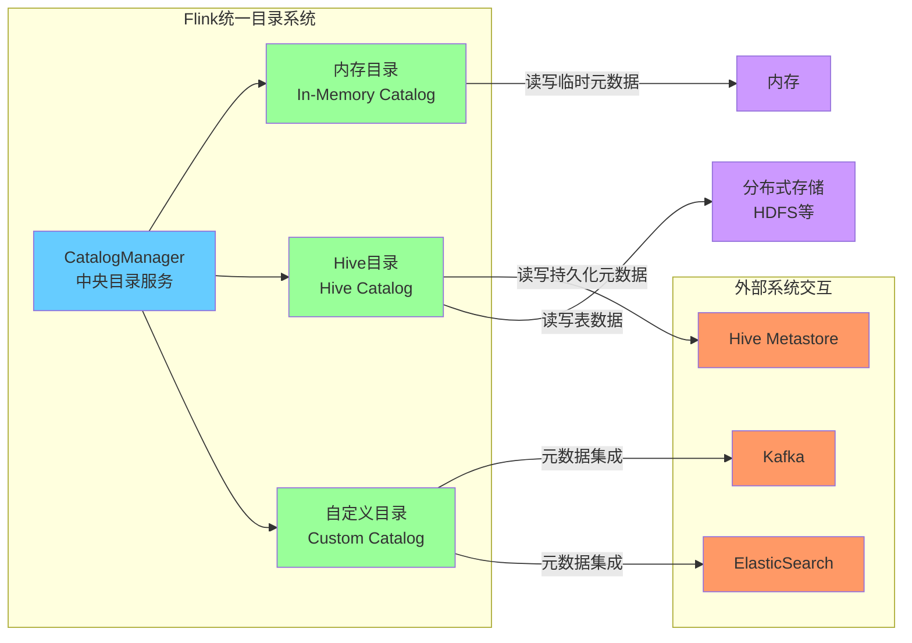
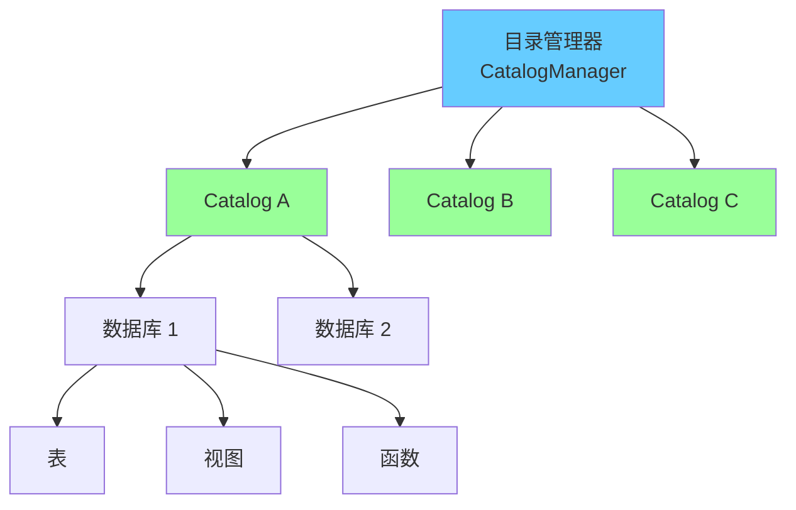

# FLIP-30：统一的目录管理 - 让 Flink 拥有自己的"图书馆"

## 开篇

想象一下，你走进一个大图书馆。这里不仅有各种类型的书籍（数据表），还有专门的导读（视图），以及各类工具书（函数）。每本书都有它的分类、位置和详细信息记录在图书馆的管理系统中。这就像 Flink 需要的目录系统：一个统一管理各类数据资源的地方。

FLIP-30 正是为了给 Flink 打造这样一个"数字图书馆"，它让 Flink 能够统一管理各种数据资源，并且可以无缝对接其他系统（比如 Hive）的"图书馆"。这个改进在 Flink 1.9 版本中实现。

## 为什么需要统一的目录系统？

让我们通过图书馆的比喻来理解这个问题：



### 以前的问题

1. **信息孤岛**：就像每个部门都有自己的小型图书室，各自维护自己的书籍清单，没有统一的管理系统。在 Flink 中，每个连接器（比如 Kafka、Elasticsearch）都需要单独管理自己的元数据。

2. **重复建设**：类似于多个图书室都在记录同一本书的信息，浪费人力物力。在系统层面，这意味着相似的元数据管理代码在不同地方重复出现。

3. **难以集成**：就像两个图书馆想要共享资源目录，却发现各自的编目系统完全不同。特别是在与 Hive 这样的数据仓库系统集成时，就会遇到这样的问题。

### 新方案的优势



1. **统一管理**：就像现代图书馆的集中管理系统，统一的目录 API 让所有数据资源都可以在一个地方管理。

2. **灵活扩展**：类似于图书馆可以连接其他图书馆的目录系统。新的目录系统可以方便地接入外部系统，比如 Hive 的元数据服务。

3. **功能完整**：不只是管理"图书"（数据表），还能管理"导读"（视图）、"工具书"（函数）等各类资源。

## 核心设计

让我们来看看这个"数字图书馆"是如何设计的：

### 基础架构



就像一个图书馆集团可以管理多个分馆一样，CatalogManager 可以统一管理多个目录系统。每个目录都可以包含多个数据库，每个数据库又可以包含表、视图和函数等资源。

### 核心组件

| 组件名 | 功能 | 类比 |
|-------|------|------|
| CatalogManager | 管理所有目录 | 图书馆总管理系统 |
| Catalog | 单个目录服务 | 分馆管理系统 |
| CatalogDatabase | 数据库 | 图书分类 |
| CatalogTable | 数据表 | 图书 |
| CatalogView | 视图 | 导读 |
| CatalogFunction | 函数 | 工具书 |

### 代码示例

以下是如何使用统一目录 API 的示例：

```java
// 创建目录
Catalog catalog = new HiveCatalog(
    "myhive", 
    "default",
    "<hive_conf_dir>"
);

// 创建表
catalog.createTable(
    new ObjectPath("mydb", "mytable"),
    new CatalogTableImpl(...),
    false
);

// 创建视图
catalog.createView(
    new ObjectPath("mydb", "myview"),
    new CatalogViewImpl(...),
    false
);

// 注册函数
catalog.createFunction(
    new ObjectPath("mydb", "myfunc"),
    new CatalogFunctionImpl(...),
    false
);
```

## 实现细节

实现这样的"数字图书馆"系统需要考虑很多细节：

1. **元数据属性**：就像每本书都有版本号、出版日期等信息，在目录系统中每个对象（数据库、表、视图等）都可以有自定义属性，比如创建时间、访问时间等。

2. **命名规范**：就像图书的索书号系统，每个表都需要有唯一的标识，格式为 `catalog.database.table`。当不指定目录名时，系统会使用默认目录。

3. **默认数据库**：类似于图书馆设置主题阅览室，用户可以用"use catalog.database"命令设置默认的目录和数据库，简化日常操作。

4. **变更管理**：支持表的创建、修改、删除等操作，就像图书馆的图书采编流程。

5. **配置管理**：在 YAML 配置文件中可以定义多个目录，包括内存目录、Hive目录等，每个目录都可以设置专属的连接参数。

6. **自动发现机制**：系统提供了类似图书馆联盟的机制，当一个目录不提供特定的表工厂时，会自动通过 Java SPI 机制发现合适的实现。

## 总结

FLIP-30 通过引入统一的目录 API，为 Flink 构建了一个完整的"数字图书馆"系统。这个系统不仅让 Flink 能够更好地管理自己的数据资源，还能与其他系统（如 Hive）的"图书馆"无缝对接。

如果说之前的 Flink 是一个个分散的小型图书室，那么现在的 Flink 就拥有了一个现代化的图书馆管理系统。它不仅可以管理自己的馆藏，还能与其他图书馆互联互通。这种统一和标准化的管理方式，为 Flink 在批处理、流处理等场景下的应用提供了坚实的基础。
