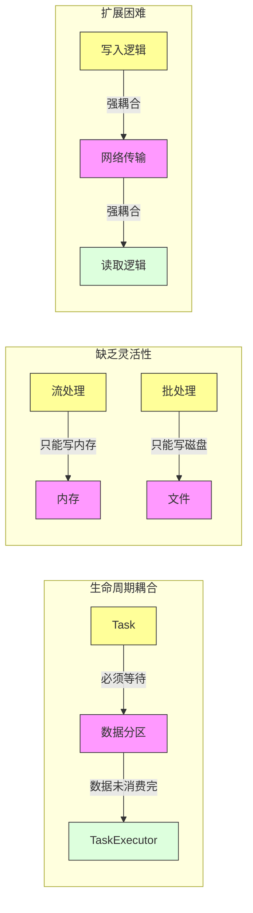
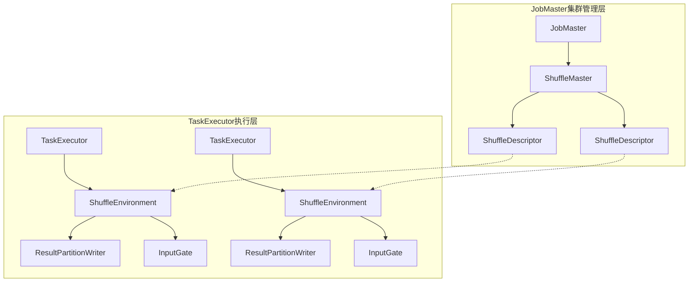

# FLIP-31 可插拔的数据交换服务：让 Flink 数据传输更灵活

## 开篇

想象一下在一个繁忙的国际机场，不同航站楼之间需要运送各种旅客和行李。传统的做法是所有运送都通过固定的地勤车辆，但如果某个航站楼的客流特别大，或者需要特殊的运输方式（比如贵重物品运输），这种固定的运输方式就显得不够灵活了。

Flink 中的数据交换（Shuffle）服务就像这样一个机场运输系统。在 FLIP-31 之前，Flink 的数据交换服务是统一的，无论是流处理还是批处理作业都采用相同的方式。这就像所有旅客和行李都必须乘坐同一种摆渡车，不够灵活。FLIP-31 提出了可插拔的数据交换服务架构，让系统能够根据不同场景选择最合适的运输方式。

## 为什么需要改进？

让我们通过一个图来看看现有方案存在的主要问题：



主要存在三个问题：

1. **生命周期管理问题**：就像机场的地勤人员（TaskExecutor）必须等所有航班的旅客和行李（数据分区）都妥善安置才能结束工作一样，当前的设计中，TaskExecutor 和数据传输过程是紧密耦合的，这导致资源无法及时释放。

2. **灵活性不足**：现有的方案对于流处理任务只能将数据写入内存，对于批处理任务则只能写入本地文件。这就像机场只能用固定的航站楼处理所有航班，无法根据实际情况灵活调度 - 国际航班必须在 A 航站楼起降，国内航班必须在 B 航站楼，即使 A 航站楼已经拥堵不堪，B 航站楼却空闲也无法调整。

3. **难以扩展**：如果想要添加新的数据传输方式（比如基于 RDMA 的高速传输），需要同时修改数据的写入和读取逻辑，这个过程很复杂。这就像要在已经运营的机场中改造整个地面交通系统一样困难。

## FLIP-31 的解决方案

FLIP-31 提出的可插拔数据交换服务架构，就像是给机场配备了一套智能调度系统，可以根据不同类型的运输需求选择最合适的运输方式。让我们详细看看解决方案：

### 整体架构设计

从架构层面，方案引入了三个核心组件：



1. **集群管理层**
   - JobMaster 负责作业调度和管理
   - ShuffleMaster 管理所有数据分区的生命周期
   - ShuffleDescriptor 描述每个数据分区的配置信息

2. **执行层**
   - TaskExecutor 执行具体的计算任务
   - ShuffleEnvironment 提供数据交换的运行时环境
   - ResultPartitionWriter/InputGate 处理数据的写入和读取

### 完整工作流程

以一个数据传输任务为例，完整的工作流程是：

1. **初始化阶段**
```java
// 1. 创建 ShuffleMaster
ShuffleMaster<?> shuffleMaster = shuffleServiceFactory.createShuffleMaster(config);

// 2. 在每个 TaskExecutor 上创建 ShuffleEnvironment
ShuffleEnvironment<?, ?> environment = shuffleServiceFactory.createShuffleEnvironment(context);
```

2. **数据分区注册**
```java
// 3. 生产者任务注册数据分区
ShuffleDescriptor descriptor = shuffleMaster.registerPartitionWithProducer(
    partitionDescriptor,
    producerDescriptor
).get();

// 4. 创建结果分区写入器
ResultPartitionWriter writer = environment.createResultPartitionWriters(
    taskInfo, descriptor
);
```

3. **数据传输阶段**
```java
// 5. 消费者请求数据
InputGate reader = environment.createInputGates(
    taskInfo, 
    descriptors,
    metrics
);

// 6. 更新分区信息
environment.updatePartitionInfo(
    consumerId,
    partitionInfo
);
```

4. **资源释放阶段**
```java
// 7. 释放数据分区
shuffleMaster.releasePartitionExternally(descriptor);
```

### 扩展机制

新的架构支持多种数据交换实现：

1. **本地磁盘实现**
```java
public class LocalShuffleServiceFactory implements ShuffleServiceFactory {
    @Override
    public ShuffleEnvironment createShuffleEnvironment(...) {
        return new LocalShuffleEnvironment(
            fileSystem,
            bufferSize,
            ...
        );
    }
}
```

2. **外部存储实现**
```java
public class ExternalShuffleServiceFactory implements ShuffleServiceFactory {
    @Override
    public ShuffleEnvironment createShuffleEnvironment(...) {
        return new ExternalShuffleEnvironment(
            storageService,
            networkConfig,
            ...
        );
    }
}
```

### 核心机制实现

在数据传输过程中，系统会经历以下几个关键阶段：

1. **分区注册和释放机制**
```java
// ShuffleMaster 的分区生命周期管理
public class ShuffleMasterImpl<T extends ShuffleDescriptor> {
    public CompletableFuture<T> registerPartitionWithProducer(...) {
        // 1. 创建分区描述符
        T descriptor = createShuffleDescriptor(...);
        
        // 2. 注册到分区管理器
        partitionTracker.startTrackingPartition(
            producerId, 
            descriptor
        );
        
        return CompletableFuture.completedFuture(descriptor);
    }

    public void releasePartition(...) {
        // 3. 安全地释放分区资源
        partitionTracker.stopTrackingAndReleasePartition(
            producerId,
            partitionId
        );
    }
}
```

2. **数据读写处理流程**
```java
// 数据写入处理
public class ResultPartitionWriter {
    public void writeData(ByteBuffer data) {
        // 1. 获取可用缓冲区
        BufferBuilder bufferBuilder = requestBufferBuilder();
        
        // 2. 写入数据
        bufferBuilder.append(data);
        
        // 3. 完成写入并通知下游
        ResultSubpartition target = subpartitions[targetChannel];
        target.add(bufferBuilder.createBufferConsumer());
    }
}

// 数据读取处理
public class InputGate {
    public Optional<BufferOrEvent> getNext() {
        // 1. 检查可用性
        if (isAvailable()) {
            // 2. 获取下一个缓冲区
            return inputChannels.getNextBuffer();
        }
        // 3. 处理背压
        return handleBackPressure();
    }
}
```

3. **故障恢复机制**
```java
public class ShuffleEnvironment {
    public void handleTaskFailure(ExecutionAttemptID taskId) {
        // 1. 识别受影响的分区
        Collection<ResultPartitionID> affected = 
            findAffectedPartitions(taskId);
            
        // 2. 触发局部恢复
        for (ResultPartitionID partitionId : affected) {
            // 仅重启必要的任务
            restartProducerTask(partitionId);
        }
    }
}
```


## 实现带来的好处

相比传统方案，新的架构带来了显著的改进：

|    特性    | 传统方案 | FLIP-31 方案 |
|------------|----------|--------------|
| 资源管理   | 固定绑定 | 灵活调度     |
| 扩展性     | 较差     | 良好         |
| 实现方式   | 单一     | 可插拔       |
| 生命周期   | 强耦合   | 独立管理     |
| 故障恢复   | 全局重启 | 局部恢复     |

## 在 Flink 中的应用

FLIP-31 在 Flink 1.9 版本中实现。这次实现主要分为以下几个阶段：

1. **基础架构实现**
   - 引入 ShuffleMaster 到 JobMaster 端，负责管理分区的生命周期
   - 引入 ShuffleEnvironment 到 TaskExecutor 端，封装数据交换逻辑
   - 实现 ShuffleServiceFactory 接口及其默认的基于 Netty 的实现

2. **分区管理优化**
   - 实现分区结果的注册和注销流程
   - 完善基于 ShuffleMaster 的资源释放机制
   - 优化 NetworkEnvironment 的构造方法
   - 重构 ResultPartitionManager，解除与 Task 的耦合

3. **指标采集集成**
   - 引入 InputGateWithMetrics 采集数据流入指标
   - 将网络指标设置移至 NetworkEnvironment 
   - 引入可扩展的指标分组布局

如果想使用这个特性，可以通过配置文件指定 ShuffleServiceFactory 的实现类：

```yaml
shuffle-service-factory.class: org.apache.flink.runtime.shuffle.NettyShuffleServiceFactory
```

当前的默认实现是基于 Netty 的网络通信方案，它与之前的行为保持兼容。在未来，还可以根据需要实现其他的数据交换服务，比如：
- 基于 RDMA 的高性能实现
- 支持外部存储的实现
- 适用于特定环境（如 Kubernetes）的实现

## 总结

FLIP-31 通过引入可插拔的数据交换服务架构，解决了 Flink 在数据传输方面的几个关键问题：

1. 通过将 TaskExecutor 和数据传输解耦，使得资源管理更加灵活
2. 通过标准化接口，让添加新的数据传输实现变得简单
3. 通过独立的生命周期管理，提高了系统的可靠性

就像现代机场可以根据不同旅客和行李的需求选择不同的运输方式一样，有了 FLIP-31，Flink 也能够根据实际需求选择最合适的数据交换方式，这让 Flink 在处理不同场景的数据时变得更加高效和灵活。
