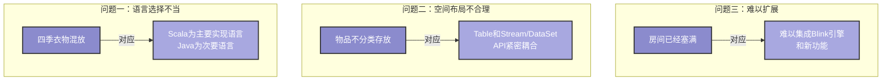
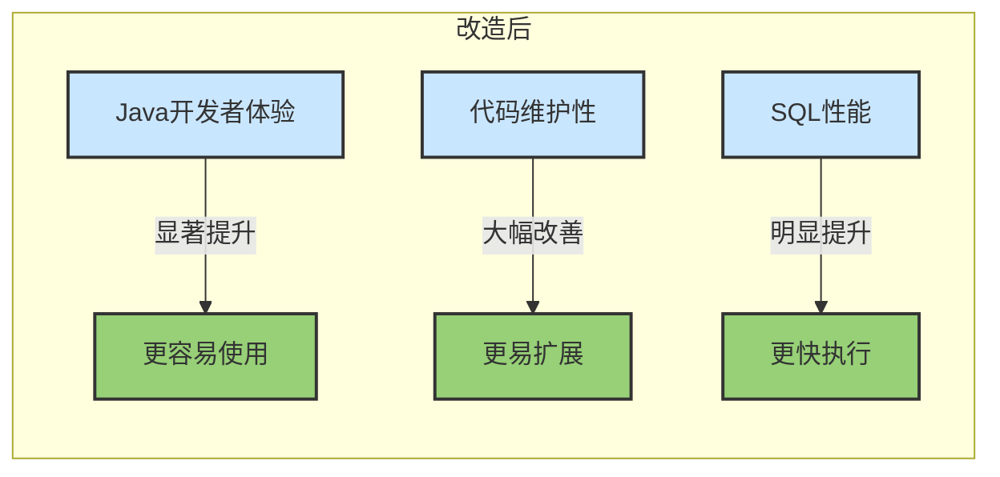

# FLIP-32: 收拾房间：Flink SQL 的重大整理革新

## 开篇

想象一下，你有一个混乱的房间 - 衣服、书本、玩具都杂乱无章地堆放在一起。这就像是 Flink 的 Table & SQL API 在2019年初的状态。虽然功能强大，但由于历史原因，代码结构变得复杂难维护。FLIP-32 就像是一次大规模的房间整理，不仅要整理现有的物品，还要为未来添置新家具预留合适的空间。

## 为什么需要这次大整理？

让我们继续用整理房间的比喻来理解当时的问题：



### 问题一：语言选择不当
就像衣柜里混杂着四季的衣服，Table & SQL API最初是用Scala编写的。虽然Scala提供了优雅的语法特性，但这导致Java用户使用起来不够顺畅，而Java仍是Flink最重要的API语言。

### 问题二：空间布局不合理
就像书籍、玩具、衣物都堆在一起，Table & SQL API与DataSet和DataStream API紧密耦合。这种设计让独立使用Table & SQL变得困难，也不利于后续发展。

### 问题三：难以添加新物品
就像一个已经塞满的房间很难再添置新家具，当时的代码结构让添加新特性变得困难。尤其是在需要集成Blink SQL引擎的情况下，现有架构显得捉襟见肘。

## 整理方案

这次"大扫除"的方案非常系统，就像请了个收纳专家来帮忙：


### 第一阶段：模块拆分
就像给房间里的物品分类，代码被重新组织成多个清晰的模块：

- flink-table-common：基础接口和公共类
- flink-table-api-java：Java API模块
- flink-table-api-scala：Scala API模块
- flink-table-planner：SQL引擎和优化器
- flink-table-runtime：执行时所需的代码

### 第二阶段：API改进
类似于给每类物品找到最合适的储存方式，这个阶段主要改进了API设计：

- 统一了批处理和流处理的接口
- 简化了TableEnvironment的使用方式
- 增强了类型系统的能力

### 第三阶段：引擎整合
就像在整理好的房间里安装新家具，这一阶段将Blink SQL引擎整合进来，带来了更强大的SQL优化能力和更好的性能。

## 实际效果

这次改造在Flink 1.14版本中完成，带来了显著的改进：



## 使用示例

经过重构后，使用Table API变得更加简单直观：

```java
// 新版API使用示例
TableEnvironment tEnv = TableEnvironment.create();

tEnv.executeSql("CREATE TABLE Orders ("+
    "order_id BIGINT,"+
    "price DECIMAL(10, 2),"+
    "order_time TIMESTAMP(3)"+
    ") WITH (...);");

// 执行SQL查询
tEnv.executeSql(
    "SELECT TUMBLE_START(order_time, INTERVAL '1' HOUR) as hour_start,"+
    "       SUM(price) as total_amount"+
    "FROM Orders"+
    "GROUP BY TUMBLE(order_time, INTERVAL '1' HOUR)"
).print();
```

## 总结

FLIP-32的完成就像是一次成功的大扫除 - 不仅让房间焕然一新，还为未来预留了成长空间。这次改造让Flink的Table & SQL API更加强大和易用，为后续功能扩展打下了坚实基础。正如一个整洁有序的房间能提高生活品质，重构后的Table & SQL API也让开发体验变得更加愉悦。这个改进在Flink 1.14版本中完成，标志着Flink在流处理SQL领域迈出了重要的一步。
