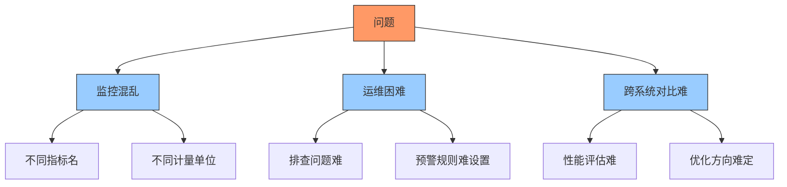
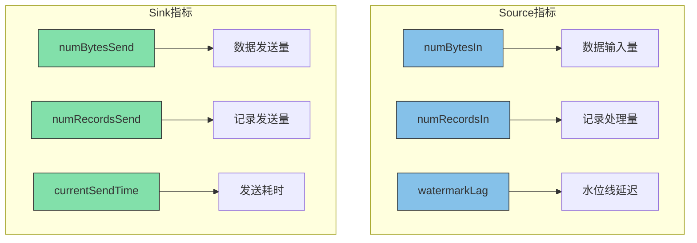

# FLIP-33: 让监控有标准：Flink 连接器的度量指标规范化

## 开篇

在繁忙的机场管制室里，统一的飞行状态报告标准至关重要。如果每个航空公司都用不同的方式报告 —— 速度有用英里每小时和公里每小时的，高度有用英尺和米的，还有及时和延迟的差异，管制员根本无法高效工作。Flink 早期版本的连接器度量指标就存在同样的问题：每个连接器都用自己的方式和名称来记录状态，这严重影响了开发和运维效率。

FLIP-33 引入了一套统一的度量指标标准，建立了 Flink 连接器的"空中管制规范"。这项在 Flink 1.14 版本中实现的改进，让连接器监控和运维工作步入正轨，效率大幅提升。

## 为什么需要统一的度量指标？



### 1. 监控一致性问题
航班管制要求所有飞机按统一格式报告位置、速度和高度。同理，连接器也需要报告基本运行状态。但在标准化之前，Kafka 连接器和 File 连接器经常用不同的名字表示同一指标，导致监控工作混乱不堪。

### 2. 运维效率问题
系统出现问题时，运维人员必须快速定位原因。但当每个连接器都用自己的方式报告问题，故障排查就变成了翻译多国文档，效率自然大打折扣。

### 3. 横向对比困难
对比不同连接器性能时，指标不统一会让比较失去意义，犹如一个国家用 GDP、另一个用 GNP 来衡量经济，根本无法得出有效结论。

## FLIP-33 带来了什么改变？



### 标准化的 Source 指标

对于数据源连接器，FLIP-33 定义了一系列标准指标：

| 指标名称 | 类型 | 单位 | 说明 | 是否必需 |
|---------|------|------|------|----------|
| numBytesIn | 计数器 | 字节 | 输入数据总量 | 是 |
| numRecordsIn | 计数器 | 条数 | 处理记录总数 | 是 |
| numRecordsInErrors | 计数器 | 条数 | 错误记录数 | 是 |
| currentEmitEventTimeLag | 度量器 | 毫秒 | 事件时间延迟 | 是 |
| watermarkLag | 度量器 | 毫秒 | 水位线延迟 | 是 |
| sourceIdleTime | 度量器 | 毫秒 | 空闲时间 | 否 |
| pendingRecords | 度量器 | 条数 | 待处理记录数 | 否 |

### 标准化的 Sink 指标

对于数据输出连接器，定义了这些标准指标：

| 指标名称 | 类型 | 单位 | 说明 | 是否必需 |
|---------|------|------|------|----------|
| numBytesSend | 计数器 | 字节 | 发送数据总量 | 是 |
| numRecordsSend | 计数器 | 条数 | 发送记录总数 | 是 |
| numRecordsSendErrors | 计数器 | 条数 | 发送错误数 | 是 |
| currentSendTime | 度量器 | 毫秒 | 发送耗时 | 否 |

这些指标构成了连接器的监控仪表盘：

- **计数器型指标**：记录累计处理量，反映总体工作量
- **速率型指标**：展示单位时间处理能力，体现实时性能
- **度量器指标**：显示当前运行状态，监控即时表现

## 如何使用这些指标？

使用标准化指标的方式非常直观。以 Kafka Source 为例：

```java
// 获取指标组
MetricGroup kafkaSourceMetrics = getRuntimeContext().getMetricGroup();

// 注册必需的指标
Counter numBytesIn = kafkaSourceMetrics.counter("numBytesIn");
Counter numRecordsIn = kafkaSourceMetrics.counter("numRecordsIn");

// 更新指标
numBytesIn.inc(record.serializedValueSize());
numRecordsIn.inc();
```

这些指标可以通过 Flink 的监控系统（如 Prometheus）进行收集和展示，让你能够：

1. 实时监控连接器性能
2. 设置合理的告警阈值
3. 进行性能分析和优化
4. 快速定位问题

## 对开发者意味着什么？

对于开发者来说，FLIP-33 带来了几个重要变化：

1. **标准化接口**：新的连接器只需要实现标准的度量接口
2. **向后兼容**：原有的自定义指标可以保留，与标准指标共存
3. **更好的工具支持**：统一的指标便于开发监控工具

## 总结

FLIP-33 为 Flink 连接器建立了统一的度量标准，确保所有连接器采用相同方式描述工作状态。这项标准化改进不仅简化了监控流程，更为整个 Flink 生态系统带来了更强的可维护性和可观测性。

标准化度量体系让开发者和运维人员获得了：
- 清晰的连接器性能对比视角
- 高效的问题排查能力
- 准确的系统状态把握

这项在 Flink 1.14 版本落地的改进，标志着 Flink 在可观测性领域迈出重要一步。统一的连接器度量标准，正如航空业的空管规范，让整个系统运行更有序、更高效。
