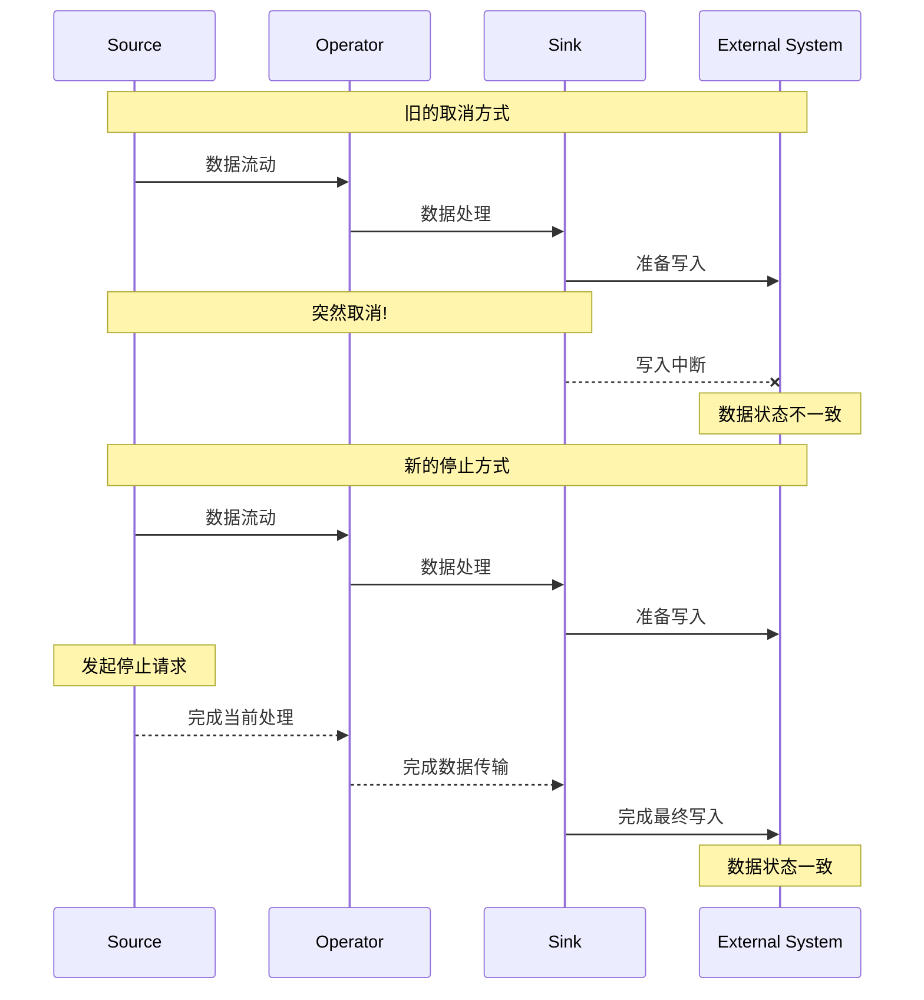

# FLIP-34 列车运行的完美停靠：Flink 作业优雅的终止与暂停方案

想象一趟正在运行的列车需要停靠或终止运行。如果突然拉下紧急制动闸，虽然列车会停下来，但乘客可能会摔倒，行李可能会散落，这显然不是理想的停车方式。列车应该缓慢减速，让乘客有时间做好准备，平稳停靠在站台。Flink的作业停止机制也需要这样的优雅性。

## 为什么需要新的停止机制？

在Flink早期版本中，停止作业主要依赖"使用保存点取消(Cancel with Savepoint)"的机制。这就像列车司机同时做了两件事：

1. 拍下当前场景的照片（保存点）
2. 立即拉下紧急制动闸（取消作业）

这个方案存在一个关键问题：当拍照完成后立即拉下制动闸，列车还在高速运行，很多乘客（数据）还没来得及妥善安置就被迫下车。具体到技术层面，这意味着一些正在进行的操作（如文件写入、数据库事务）可能无法正确完成。



## 新方案：SUSPEND和TERMINATE

就像列车有不同的停靠方式，FLIP-34引入了两种新的作业停止模式：

### SUSPEND模式（临时停靠）
这就像列车临时停靠在站台：
- 只是暂时停止，未来会重新启动
- 保留所有"乘客状态"（不触发窗口的最终计算）
- 确保所有正在进行的操作都能完成
- 作业状态标记为FINISHED，表示正常停止

### TERMINATE模式（终点站）
这相当于列车到达终点站：
- 永久停止，不再重新启动
- 触发所有"到站提醒"（发出最大水位线，触发窗口的最终计算）
- 确保所有数据都被正确处理和保存
- 作业状态同样标记为FINISHED


两种模式的主要区别在于对事件时间语义的处理：

| 特性 | SUSPEND | TERMINATE |
|------|----------|------------|
| 目的 | 临时停止 | 永久终止 |
| 事件时间定时器 | 保持不触发 | 触发所有定时器 |
| 窗口计算 | 保持当前状态 | 完成所有计算 |
| 状态处理 | 保存现状 | 清理并持久化 |
| 外部系统操作 | 完成进行中的操作 | 完成所有操作并关闭连接 |

## 实现细节

新的停止机制就像是经过精心设计的列车调度系统，包含以下关键环节：

1. **同步保存点**
   - 作业管理器发出停止信号
   - 所有任务同步进行状态保存
   - 等待保存确认完成

2. **优雅关闭**
   - 数据源停止接收新数据
   - 在TERMINATE模式下发出最大水位线
   - 等待所有操作完成确认

3. **状态转换**
   - 作业状态变更为FINISHED
   - 清理相关资源

## 实现状态

此改进最初在Flink 1.9版本中实现，后续在1.15版本中又有重要更新。现在支持更多灵活的使用方式：

### 保存点格式选择

现在可以选择两种保存点格式：

1. **标准格式(Canonical)**:
   - 统一的跨状态后端格式
   - 提供最好的兼容性
   - 适合版本迁移和状态模式变更

2. **原生格式(Native)**:
   - 在Flink 1.15中引入
   - 使用状态后端的原生格式（如RocksDB的SST文件）
   - 提供更好的性能

### 所有权模式选择

引入了三种所有权模式来控制保存点文件的生命周期：

1. **NO_CLAIM模式(默认)**:
   - Flink不接管保存点的所有权
   - 允许从同一保存点启动多个作业
   - 第一次检查点会是完整检查点

2. **CLAIM模式**:
   - Flink接管保存点的完整所有权
   - 可能会自动清理不需要的保存点文件
   - 不能从同一保存点启动多个作业

3. **LEGACY模式(已废弃)**:
   - 向后兼容的旧模式
   - 在Flink 2.0中将被移除

### 命令示例

```bash
# 暂停作业（默认使用标准格式）
$ flink stop [作业ID]

# 使用原生格式终止作业
$ flink stop --type native --terminate [作业ID]

# 异步触发保存点
$ flink savepoint [作业ID] [目标路径] -detached

# 使用指定的所有权模式恢复
$ flink run -s [保存点路径] -claimMode [NO_CLAIM|CLAIM] [其他参数]
```

## 总结

FLIP-34通过引入SUSPEND和TERMINATE两种停止模式，让Flink作业的停止过程变得更加优雅和可控。就像现代化的列车调度系统一样，它保证了：

1. 数据处理的完整性 - 所有进行中的操作都能得到妥善处理
2. 状态管理的可靠性 - 保存点的生成和状态的持久化更加可靠
3. 外部系统的一致性 - 确保与外部系统的交互能够正常完成

这一改进让Flink在处理作业停止时更加成熟和可靠，为需要频繁停止、升级、维护的生产环境提供了更好的支持。
