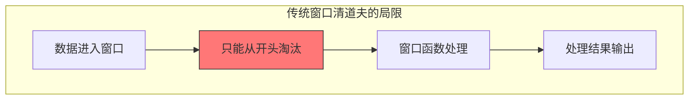
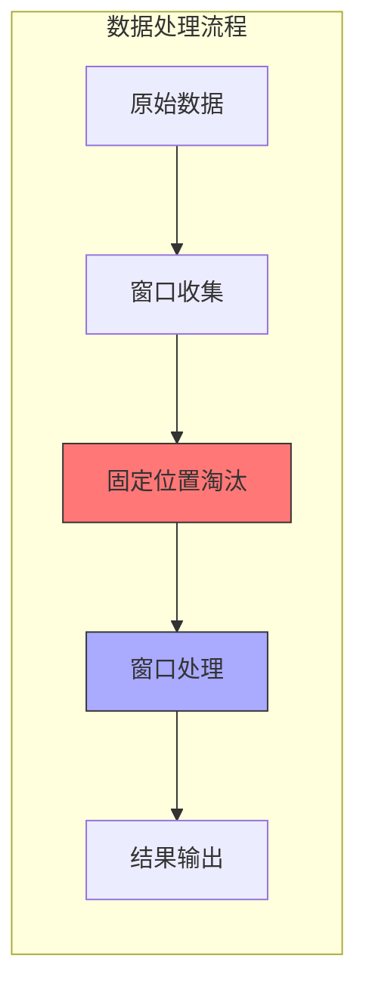
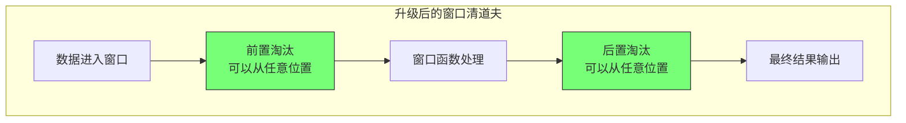

# FLIP-4 窗口清道夫升级：让数据淘汰更灵活

## 开篇

在Flink中，窗口（Window）是一种对无界数据流进行切分的重要机制。每个窗口会收集一段时间内的数据，让我们能够对这些有限的数据进行计算和处理。但在实际应用中，并不是窗口内的所有数据都是有价值的。这就是为什么Flink提供了窗口清道夫（Window Evictor）机制，它能够根据特定的规则从窗口中清理掉不需要的数据。

举个例子，假设你在处理传感器数据，每个窗口包含10分钟内的温度读数。有些读数可能是由故障的传感器产生的异常值，这些数据如果不及时清理，就会影响后续的计算结果。窗口清道夫就是专门负责这种数据清理工作的组件，它可以帮助我们确保只有有效的数据才会参与计算。

你可以把这个机制想象成一个图书管理员，每天都要整理一个时间段内归还的书籍。按照老规矩，你只能从最早归还的书开始处理，而且必须在整理上架之前就决定要处理哪些书。但有时候，你可能想在整理完之后再决定哪些书需要送去修补，或者想根据书的状况（而不是归还时间）来决定处理顺序。

这就是 Flink 中"窗口清道夫"（Window Evictor）面临的问题。在 FLIP-4 之前，它只能在窗口函数处理数据之前，从窗口的开头淘汰数据。这就像图书管理员被限制只能按固定方式工作一样不够灵活。FLIP-4 的目标就是要打破这些限制，让数据淘汰变得更加智能和灵活。

## 老方案有啥问题？

让我们通过一个更直观的例子来理解原来的窗口清道夫有什么局限：



主要存在两个限制：

第一个限制是"只能从头开始淘汰"。就像图书管理员被要求必须从最早归还的书开始处理一样，即使有些新归还的书更需要立即处理。在实际应用中，可能最新的数据反而更重要，或者我们想根据数据的具体内容来决定是否保留，而不是简单地看它的位置。

第二个限制是"只能在处理前淘汰"。这就像图书管理员必须在整理上架前就决定要处理哪些书，而不能在整理过程中发现问题再处理。在数据处理中，有时候我们需要先看看处理结果，再决定是否要淘汰一些数据。

让我们看看在不同场景下这些限制带来的影响：



比如：
1. 在传感器数据处理中，可能想根据数据质量而不是时间顺序来决定保留哪些数据
2. 在交易系统中，可能需要在计算完一批交易的统计信息后，再决定是否要剔除一些异常交易

## FLIP-4 是怎么解决的？

FLIP-4 给窗口清道夫带来了两个重要的改进：



### 更灵活的淘汰位置

现在，清道夫可以根据具体需求从窗口的任何位置淘汰数据，不再局限于从开头开始。这就像图书管理员可以根据书籍的实际状况，而不是仅仅按照归还顺序来决定处理哪些书。

### 更智能的处理时机

引入了两个处理时机：
系统会在两个时间点进行数据淘汰：一次是在窗口函数处理数据之前（evictBefore），另一次是在处理之后（evictAfter）。这种设计让我们能够根据处理的结果来决定是否需要进一步淘汰数据。

## 具体怎么实现的？

FLIP-4 通过改进接口设计来实现这些功能。新的Evictor接口包含两个核心方法：
```java
void evictBefore(Iterable<TimestampedValue<T>> elements, 
                 int size, 
                 W window, 
                 EvictorContext evictorContext);

void evictAfter(Iterable<TimestampedValue<T>> elements, 
                int size, 
                W window, 
                EvictorContext evictorContext);
```

同时，系统提供了几种预置的实现。CountEvictor用来按数量淘汰数据，DeltaEvictor根据数值差异来淘汰，TimeEvictor则按时间来淘汰数据。每种实现都可以灵活配置，选择在窗口函数前后执行。比如对于DeltaEvictor：

```java
// 默认配置：在窗口函数前执行淘汰
DeltaEvictor.of(threshold, deltaFunction)

// 或者显式指定在窗口函数前执行淘汰
DeltaEvictor.of(threshold, deltaFunction, false)

// 配置在窗口函数后执行淘汰
DeltaEvictor.of(threshold, deltaFunction, true)
```

这里的第三个参数doEvictAfter用来控制淘汰的时机：当设置为false时（这也是默认值），淘汰操作会在窗口函数处理数据之前执行；当设置为true时，淘汰操作会在窗口函数处理完数据之后执行。CountEvictor和TimeEvictor也都提供了类似的配置选项。

## 带来了哪些好处？

这次升级给 Flink 用户带来了实实在在的好处：

首先是处理逻辑更灵活了。就像给图书管理员松绑一样，现在可以根据实际需求来决定怎么处理数据，不用被固定的规则束缚。

其次是功能更强大了。通过在窗口函数前后都能进行淘汰，我们可以实现更复杂的数据处理逻辑。在处理之前，我们可以先淘汰一些明显不需要的数据，这样能够节省处理时间。处理完后，我们还可以根据处理结果来决定是否需要进一步筛选数据。

## Window Evictor和窗口函数过滤有什么区别？

在了解了窗口清道夫的工作原理后，你可能会想：我直接在窗口函数里写过滤逻辑不就行了吗？为什么要专门用Window Evictor呢？让我们以图书馆的例子来解释二者的区别：

想象你在管理一个图书馆的书籍整理流程。使用Window Evictor就像是在整理过程中真的把不合适的书拿走（可能放到专门的维修区或者直接下架），而在窗口函数中做过滤则像是在整理时用便利贴标记这些书 - 它们还在原来的位置，只是不会被计入最终的统计结果。

### 1. 处理层面不同

Window Evictor工作在窗口管理层面，它决定哪些数据可以留在窗口中。就像图书管理员在整理前就把破损的书拿走，这些书就真的不在书架上了。而窗口函数中的过滤是在业务处理时才进行筛选，就像那些贴了便利贴的书，它们还在书架上，只是在做统计时不会被计入。

### 2. 性能影响不同

使用Window Evictor时，被淘汰的数据会从窗口状态存储中移除，这样可以节省存储空间。就像把不需要的书及时移走，书架就不会太挤。而在窗口函数中做过滤，所有数据都会留在状态存储中，就像贴了便利贴的书依然占着书架的空间。

### 3. 适用场景不同

Window Evictor更适合以下场景：
```java
// 例如：基于统计信息的淘汰
.evictor(DeltaEvictor.of(
    3 * stdDev,  // 超过3个标准差的数据会被淘汰
    value -> value.getMetric()
))
```

而窗口函数中的过滤更适合简单的业务规则：
```java
@Override
public void process(Context context, Iterable<Reading> readings) {
    for (Reading r : readings) {
        if (r.getValue() != null) {  // 简单的null值检查
            // 处理有效数据
        }
    }
}
```

### 4. 灵活性不同

Window Evictor提供了更细粒度的控制，可以在处理前后两个时机进行淘汰，还能从窗口的任意位置淘汰数据。就像图书管理员可以在整理前、整理后都对书籍进行筛选，而且可以从书架的任何位置拿走不合适的书。相比之下，窗口函数中的过滤就简单得多，只能在处理时根据条件决定是否使用某条数据。

在实际应用中，这两种方式并不冲突。你可以使用Window Evictor来处理那些需要基于统计信息或者复杂规则的淘汰逻辑，而在窗口函数中保留简单的数据有效性检查。就像图书管理员会先处理明显破损的书籍，在整理过程中再过滤掉一些不合适的内容。

## 实际使用有什么建议？

### 1. 选择合适的淘汰策略

在选择淘汰器时，要根据实际的业务需求来决定。如果你只关心数据的数量，那么 CountEvictor 是个不错的选择。当你需要根据数值的差异来筛选数据时，可以使用 DeltaEvictor。如果你的场景主要是和时间相关的，那么 TimeEvictor 会是更好的选择。

### 2. 合理选择淘汰时机

选择淘汰的时机也很重要。对于那些确定不需要参与计算的数据，最好在窗口函数执行前就把它们淘汰掉，这样可以提高处理效率。如果你需要先看看数据处理的结果再决定是否要淘汰某些数据，那就选择在窗口函数后进行淘汰。

### 3. 注意性能影响

在使用这个功能时要注意性能的平衡。因为在窗口函数前后都进行淘汰会带来额外的计算开销，所以要根据实际需求来权衡。对于数据量特别大的场景，建议在窗口函数执行前就淘汰掉一部分数据，这样可以减轻后续处理的压力。

### 4. 平滑迁移

如果你已经在使用老版本的 Evictor，升级时要注意一些变化。CountEvictor 的行为基本保持不变，你可以放心使用。DeltaEvictor 的行为有所改变，它现在会检查所有的元素，不再是找到第一个就停止了。为了保持兼容性，所有的淘汰器默认都是在窗口函数前执行。

## 实际案例分析

让我们通过两个具体的案例来看看如何在实际中运用这些新特性。

### 案例一：实时数据质量控制

假设你在运营一个智能工厂的温度监控系统。每个传感器每秒都会发送温度数据，但由于各种原因（比如传感器故障、网络抖动等），数据质量可能参差不悳。在这种场景下，我们可以这样使用改进后的窗口清道夫：

```java
DataStream<SensorReading> sensorData = ...

sensorData
    .keyBy(SensorReading::getSensorId)
    .window(TumblingEventTimeWindows.of(Time.seconds(10)))
    .evictor(DeltaEvictor.of(
        5.0,  // 温差阈值
        (reading) -> reading.getTemperature(),
        true   // 在窗口函数后执行淘汰
    ))
    .process(new ProcessWindowFunction<...>() {
        @Override
        public void process(
            String sensorId,
            Context context,
            Iterable<SensorReading> readings,
            Collector<ProcessedReading> out) {
            
            // 计算平均温度和标准差
            double avgTemp = calculateAverage(readings);
            double stdDev = calculateStandardDeviation(readings, avgTemp);
            
            // 输出结果，DeltaEvictor会在这之后移除偏差过大的数据
            out.collect(new ProcessedReading(sensorId, avgTemp, stdDev));
        }
    });
```

在这个案例中，我们首先计算了窗口内所有温度数据的平均值和标准差，然后利用DeltaEvictor在窗口函数执行后移除那些偏差超过5度的异常值。这样做的好处是我们可以在了解整体数据分布的情况下，更准确地判断哪些数据是异常的。

### 案例二：金融交易异常检测

再来看一个金融领域的例子。假设我们需要监控股票交易数据，识别可能的异常交易。这时我们可以同时使用前置和后置淘汰：

```java
DataStream<StockTrade> trades = ...

trades
    .keyBy(StockTrade::getSymbol)
    .window(SlidingEventTimeWindows.of(Time.minutes(5), Time.minutes(1)))
    .evictor(new CustomTradeEvictor() {
        @Override
        public void evictBefore(
            Iterable<TimestampedValue<StockTrade>> elements,
            int size,
            Window window,
            EvictorContext ctx) {
            
            // 在处理前，移除明显的异常值（比如价格为负或交易量为0的记录）
            Iterator<TimestampedValue<StockTrade>> iterator = elements.iterator();
            while (iterator.hasNext()) {
                StockTrade trade = iterator.next().getValue();
                if (trade.getPrice() <= 0 || trade.getVolume() == 0) {
                    iterator.remove();
                }
            }
        }

        @Override
        public void evictAfter(
            Iterable<TimestampedValue<StockTrade>> elements,
            int size,
            Window window,
            EvictorContext ctx) {
            
            // 在计算完统计值后，移除可能的可疑交易
            // 比如价格波动超过统计值的3个标准差
            double avgPrice = getWindowAvgPrice(ctx);
            double stdDev = getWindowPriceStdDev(ctx);
            double threshold = 3 * stdDev;

            Iterator<TimestampedValue<StockTrade>> iterator = elements.iterator();
            while (iterator.hasNext()) {
                StockTrade trade = iterator.next().getValue();
                if (Math.abs(trade.getPrice() - avgPrice) > threshold) {
                    iterator.remove();
                    // 这些可疑交易可以另外记录下来供进一步分析
                    logSuspiciousTrade(trade);
                }
            }
        }
    })
    .process(new TradingAnalysisFunction());
```

在这个案例中，我们创建了一个自定义的交易淘汰器，它分两步工作：
1. 在窗口函数执行前，它会移除那些明显不合理的交易记录，比如价格为负或交易量为零的情况。
2. 在窗口函数执行后，它会根据计算得到的统计值（平均价格和标准差），识别并移除那些可能的异常交易。这些被移除的交易不会影响最终的分析结果，但会被单独记录下来供风控团队进一步分析。

这两个案例展示了改进后的窗口清道夫如何在实际场景中发挥作用。它不仅可以实现更精确的数据质量控制，还能支持更复杂的业务逻辑。

## 总结

FLIP-4 让 Flink 的窗口清道夫变得更智能了。就像现代图书馆的管理系统，不再受限于固定的规则，而是能够根据实际需求灵活处理数据。通过允许在任意位置淘汰数据，以及在处理前后都能进行淘汰，极大地提升了数据处理的灵活性和效率。

这个改进看似简单，但它打开了很多新的可能性。就像给图书管理员配备了更好的工具，让他们能够更好地服务读者一样，升级后的窗口清道夫能够帮助我们实现更精细和高效的数据处理。尤其在实时数据处理这样的场景中，这种灵活性显得尤为重要。
