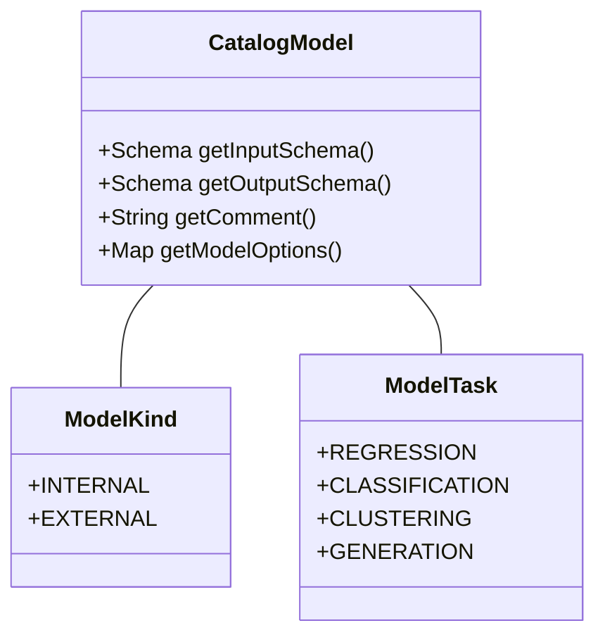
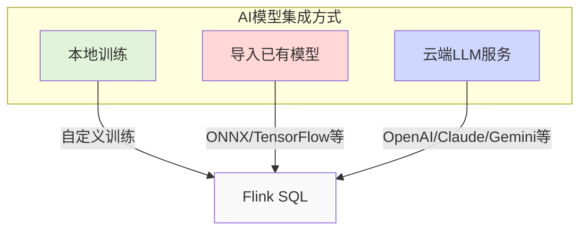
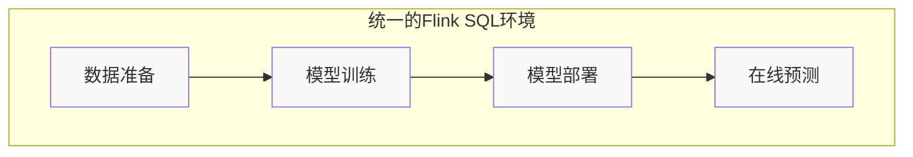

# FLIP-437: ChatGPT遇上Flink SQL：让大语言模型成为数据处理的得力助手

## 开篇

ChatGPT和生成式AI正在重塑整个科技世界。大语言模型的崛起不仅改变了人们与计算机交互的方式，也为数据处理带来了新的机遇和挑战。这个FLIP的目标，就是让Flink SQL能够原生支持包括大语言模型在内的各类AI模型，让数据处理在生成式AI时代焕发新生。

## 为什么需要这个功能？

想象一下：一个数据分析师正在处理客户反馈数据。在传统的处理流程中，ta需要在多个系统之间不停切换：


这种割裂的工作流程在大语言模型时代显得尤其笨重：首先，它需要依赖外部编排系统来协调各个环节，比如从Flink处理完的数据如何高效传递给ChatGPT API。其次，数据在不同系统间流转增加了复杂性，尤其是处理敏感数据时会带来安全隐患。此外，当模型和提示词(prompt)需要更新时，变更管理和数据血缘追踪也变得异常困难。最后，在处理实时数据流时，维护多个系统不仅成本高昂，还会带来较大的延迟和错误风险。

而这个FLIP的目标，就是要通过在Flink SQL中直接支持机器学习模型，来解决这些问题。

## 设计方案：如何实现？

### 模型作为一等公民

这个FLIP的核心思想是把机器学习模型作为Flink SQL中的"一等公民"来对待。就像表（Table）一样，模型也可以被创建、更新、删除和查询。

让我们看看在新设计下，模型是如何被定义的：



一个模型主要包含以下信息：模型首先需要定义输入输出的数据格式（Schema），以确保数据的正确流转。其次，模型的类型可以是内部或外部的，这决定了模型的存储和访问方式。模型还需要指定其任务类型，可以是回归、分类等不同类型，这关系到模型的使用场景。最后，每个模型都需要相应的参数配置，以确保模型能够正确运行和优化。

### SQL语法扩展

为了支持模型操作，Flink SQL新增了一系列语法：

```sql
-- 导入外部模型
CREATE MODEL my_import_model
INPUT (f1 INT, f2 STRING)
OUTPUT (label FLOAT)
WITH(
  'task' = 'regression',
  'type' = 'import',
  'format' = 'ONNX',
  'ONNX.path' = 'http://storage.googleapis.com/models/model.onnx'
);

-- 使用远程模型服务
CREATE MODEL my_remote_model
INPUT (f1 INT, f2 STRING)
OUTPUT (label STRING, probs ARRAY<FLOAT>)
WITH(
  'task' = 'classification',
  'type' = 'remote',
  'provider' = 'openai',
  'openai.endpoint' = 'https://api.openai.com/v1/chat',
  'openai.api_key' = '******'
);

-- 使用模型进行预测
SELECT * FROM ML_PREDICT(my_model, DESCRIPTOR(f1, f2));
```

### AI模型集成方式



这个设计支持三种使用AI模型的方式：首先是在Flink中直接训练小型模型，如分类器、回归模型等。其次是导入已经训练好的模型，这里支持ONNX等标准格式。最后是调用云端大语言模型服务，包括ChatGPT、Claude、Gemini等。

## 目前进展

这个FLIP目前正在积极开发中。从Jira的进展来看，基础的模型语法解析和Catalog变更支持已经完成，而临时模型支持和模型评估功能目前正在开发中。

社区投票已经通过，预计会在未来的Flink版本中正式发布。

## 实现后的世界会是什么样？

当这个功能完整实现后，数据处理和机器学习的工作流将变得更加流畅：



数据团队可以通过SQL直接调用ChatGPT等大语言模型来处理文本数据，同时在流处理中实时使用AI模型进行预测和生成。他们能够统一管理所有AI模型的版本和权限，并且可以完整追踪数据从原始输入到AI处理后的全流程。最重要的是，这种集成方式大幅降低了在传统机器学习和生成式AI应用上的开发部署成本。

## 总结

FLIP-437代表了Flink在生成式AI时代的关键升级。通过在SQL层面提供包括大语言模型在内的AI能力支持，它让数据处理和AI技术的结合变得空前流畅。这不仅让传统的机器学习任务变得更容易，更为Flink打开了一扇通往生成式AI的大门。尽管该功能还在开发中，但其面向未来的设计思路已经获得了社区的认可。相信在不久的将来，Flink+AI的强大组合将为数据处理带来更多可能。
