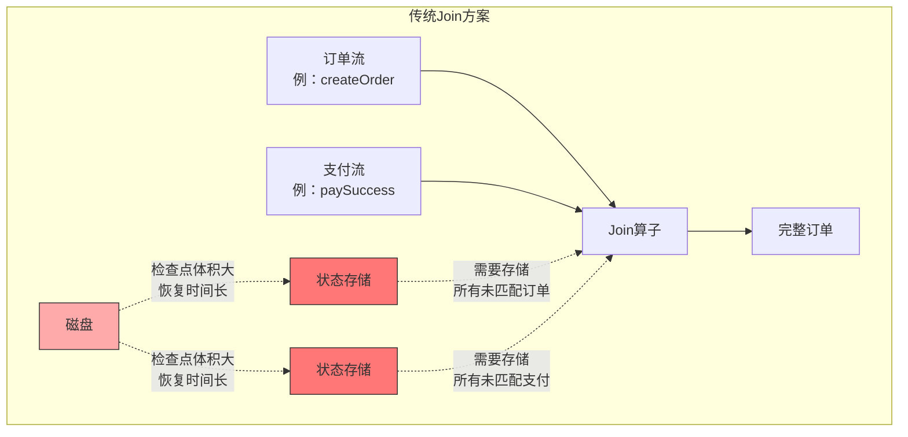
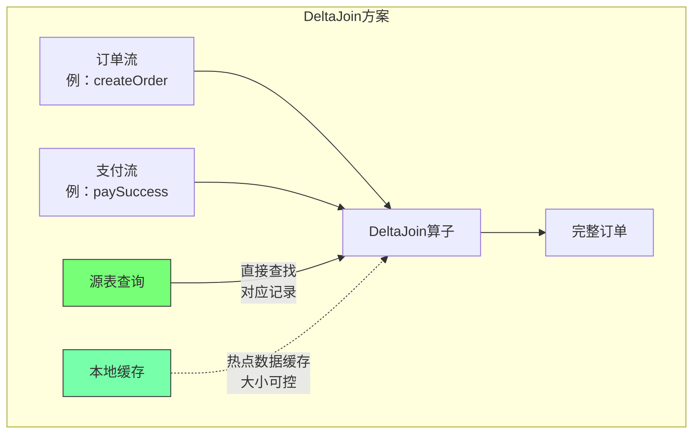
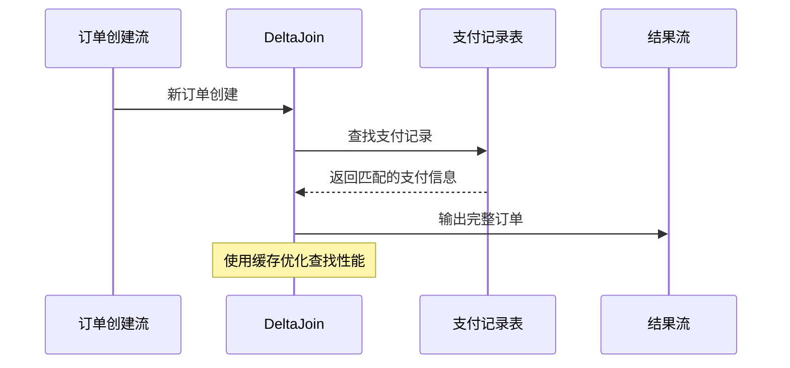
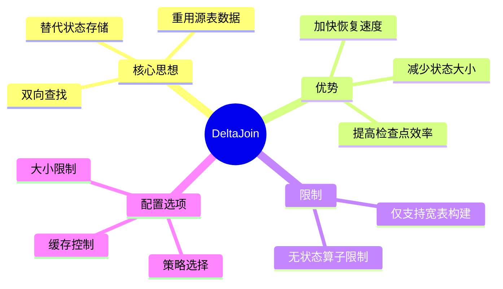

# FLIP-486：DeltaJoin - 流处理中Join状态优化的新方案

## 开篇

想象一下这个场景：一个电商平台需要实时处理订单数据，将订单创建信息与支付成功信息关联起来，以便及时更新订单状态、发货和后续处理。这个过程中会产生两个数据流：订单创建流和支付成功流。随着时间推移，未匹配的订单和支付数据会越积越多，Join操作占用的状态空间也越来越大，就像一个不断膨胀的气球，最后可能会把整个系统撑爆。这个FLIP就是为了解决这个问题，提出了一个叫做DeltaJoin的新方案。

## 为什么需要DeltaJoin？

在Flink的流处理任务中，Join节点的状态问题一直是个头疼的事情：

1. 状态会随着时间不断增长，就像滚雪球一样越滚越大
2. 大状态会导致任务变慢，就像背着越来越重的包跑步
3. 检查点保存和恢复时间变长，影响任务的稳定性

虽然可以通过设置TTL（存活时间）来清理过期数据，但这种方法并不适用于所有场景，而且也不是从根本上解决问题。

## DeltaJoin是什么？

让我们直接用订单处理的场景来理解DeltaJoin。传统的Join就像是设置了两个等待区：一个存放尚未匹配到支付信息的订单，另一个存放尚未匹配到订单的支付记录。每来一条新数据，都要先进入等待区，然后再去匹配。这样随着时间推移，等待区的订单和支付记录会越积越多。

而DeltaJoin采用了完全不同的方式：当收到新订单时，直接去查询支付记录；当收到支付成功的消息时，也直接去查询对应的订单信息。这就是所谓的"双边驱动的维表Join" —— 收到任何一边的新数据，都立即去另一边查找对应的记录。这种方式不需要设置等待区来存储未匹配的数据，效率更高，占用空间也更小。同时通过缓存机制，热门订单的支付状态可以快速查询，就像商家特别关注大额订单的支付情况一样。

让我们通过一个图来更直观地理解：

上图详细展示了传统Join和DeltaJoin在处理双流Join时的工作原理差异：

传统Join方案中：
- 需要同时维护两个流的状态数据
- 每个流都要保存未匹配的历史记录
- 状态大小随时间双向增长
- 检查点需要保存两份状态数据
- 故障恢复需要加载所有历史数据

DeltaJoin方案中：
- 新数据到达时直接查询对应记录
- 通过源表索引快速定位匹配数据
- 使用本地缓存优化查询性能
- 缓存大小可配置，避免状态膨胀
- 检查点体积小，恢复速度快

## DeltaJoin的工作方式

让我们通过一个具体的例子来说明DeltaJoin是如何工作的：

DeltaJoin的工作流程包含以下几个关键步骤：

1. 数据到达：当新订单创建时，如"用户A下了一个100元的订单"，DeltaJoin会接收这个订单创建事件。

2. 查找匹配：DeltaJoin会根据Join条件（如订单号）到支付记录表中查找对应的支付信息。这个查找过程是通过查询源表来完成的，而不是像传统Join那样查询状态。

3. 缓存优化：为了提高查找效率，DeltaJoin会将一部分常用的支付记录缓存起来。这个缓存是可配置的，通过left-cache-size和right-cache-size来控制缓存大小。如果要查找的支付记录在缓存中，就可以直接返回，不需要访问源表。

4. 结果输出：一旦找到匹配的支付记录，DeltaJoin就会将订单创建信息和支付信息关联起来，形成一条完整的订单记录输出到结果流中。

这个过程的关键优势在于：
- 不需要在状态中保存所有未匹配的订单和支付记录
- 通过缓存机制提高查询效率
- 支付信息的更新会自动反映在查询结果中
- 状态的大小只取决于缓存配置，不会随时间无限增长

举个具体的例子：假设用户在电商平台下了一个订单（订单号"ORDER001"，金额100元），这条记录会进入订单创建流。当DeltaJoin接收到这条数据时，会先检查缓存中是否有这个订单号对应的支付记录，如果没有，就去支付记录表中查询。如果找到了对应的支付成功记录，就可以输出一条完整的订单记录："ORDER001订单已完成支付，可以发货"。这种设计特别适合订单处理场景，因为它可以快速响应新订单，同时又不会积累大量状态数据。

## 使用限制

在第一个版本中，DeltaJoin有一些使用限制：

1. 只支持构建宽表的场景，这意味着输出表必须具有"忽略删除"的属性
2. 计划中除了Join外不能包含其他有状态的算子（如聚合或排序）

## 配置选项

DeltaJoin提供了一系列配置选项供用户调整：

| 配置项 | 可选值 | 默认值 | 说明 |
|-------|--------|--------|------|
| table.optimizer.delta-join.strategy | AUTO/FORCE/NONE | AUTO | 是否启用DeltaJoin |
| table.exec.delta-join.cache-enable | true/false | true | 是否启用缓存 |
| table.exec.delta-join.left-cache-size | 数值 | 10000 | 左表缓存大小 |
| table.exec.delta-join.right-cache-size | 数值 | 10000 | 右表缓存大小 |

其中，strategy的三个选项含义如下：
- AUTO：优化器会优先尝试使用DeltaJoin，如果不满足条件则回退到普通Join
- FORCE：强制使用DeltaJoin，如果不满足条件则抛出异常
- NONE：不使用DeltaJoin

## 处理数据变更

在一些场景下，源数据可能会有更新或删除操作。DeltaJoin通过在源表后添加一个特殊的DropRetract节点来处理这种情况：

这个节点会直接丢弃UPDATE_BEFORE和DELETE类型的数据，确保DeltaJoin只处理插入和更新后的数据。

## 当前进展

目前这个FLIP还处于讨论阶段，预计会在Flink 2.1版本中实现。

## 总结

DeltaJoin的设计理念是很实用的 —— 与其在Join时保存大量的状态数据，不如充分利用源表本身的数据。这种方法不仅降低了资源消耗，还提高了系统的可靠性。尽管目前还有一些限制，同时也需要一款流读与点查兼备的存储引擎来支持具体的架构落地，但这个方向是很有潜力的，期待在后续版本中看到更多的改进和突破。
