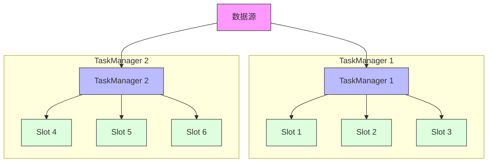
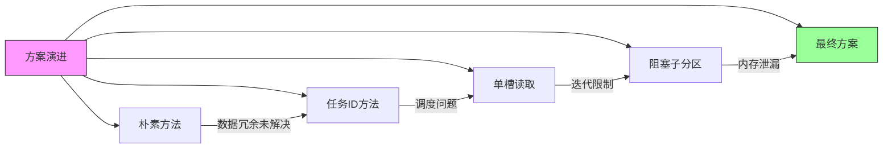
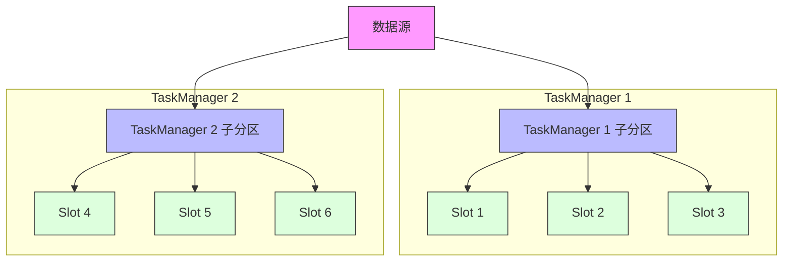

# FLIP-5：给广播变量瘦身：让数据传输更高效

## 开篇

想象一下你是一个课代表，要把一份重要的学习资料分发给班上的同学。如果班里的同学分成了几个小组，你会怎么做？是给每个小组复印一份，让组长再分给组员，还是给每个同学都复印一份？显然第一种方法更省纸、更高效。

Flink早期的广播变量（broadcast variable）分发机制就像是给每个同学都发一份资料，即使有些同学在同一个TaskManager（相当于一个小组）上。这不仅浪费网络带宽，还会影响整体性能。FLIP-5就是为了解决这个问题而提出的。

## 老方案有什么问题？

让我们用一个例子来说明当前的问题：

在上面的例子中，一个TaskManager有多个Slot（处理槽）。当我们使用广播变量时，同样的数据会被发送给每一个Slot，即使这些Slot在同一个TaskManager上。这就导致了两个主要问题：

1. 网络流量浪费：同一个TaskManager上的多个Slot接收完全相同的数据副本。
2. 性能下降：随着每个TaskManager的Slot数量增加，传输的数据量也成倍增加。

实验数据显示，当每个TaskManager的Slot数从1增加到16时，处理时间会显著增加：
- 1个Slot：约6.8秒
- 16个Slot：超过37秒

## FLIP-5提出了哪些解决方案？

研究团队提出了多个解决方案，我们来看看其中最重要的几个：

### 最终方案：重新设计数据分发机制

最终方案的核心思想是对广播数据的分发机制进行彻底改造。具体来说：

1. **一个TaskManager一个子分区**：每个TaskManager只创建和使用一个子分区（subpartition）来接收广播数据，而不是之前的每个Slot都创建一个。这就像是每个班级（TaskManager）只发一份资料给班长（子分区），而不是给每个学生（Slot）都发一份。

2. **重定向执行边**：这个方案需要修改Flink的执行图，将所有的执行边（execution edge）重定向到唯一的子分区。这就像是把原本分散的多条传递路径，统一到一条主干道上：

3. **数据共享机制**：
   - TaskManager中的一个任务被指定为"首要读取者"，负责从子分区读取数据
   - 这个任务会将数据反序列化并存储在TaskManager级别的共享内存区域中
   - 同一TaskManager上的其他任务可以直接从这个共享内存区域读取数据，避免重复的网络传输和反序列化操作
   - 这就像班长（首要读取者）先拿到资料，然后复印一份放在教室里（共享内存），其他同学都可以直接在教室里查看，而不需要再找老师要

4. **智能的释放机制**：
   - 首要读取者任务在完成数据处理后发送释放信号
   - 其他任务在使用完共享数据后发送"完成"信号
   - 系统跟踪所有任务的状态，只有在确认所有任务都不再需要数据时才释放资源
   - 这种机制确保了数据在所有任务都使用完之前不会被清除

这个方案带来了显著的改进：

1. **性能提升**：
   - 数据传输量大大减少，网络负载显著降低
   - 处理时间保持稳定，即使增加Slot数量也不会显著增长
   - 实验数据显示，即使将Slot数从1增加到16，处理时间仍然保持在6-7秒左右

2. **资源利用优化**：
   - 每个TaskManager的数据只需要传输和存储一次
   - 内存使用更加高效，避免了重复数据的存储
   - 网络连接数量大幅减少

3. **更好的可扩展性**：
   - 系统性能不再随着单个TaskManager的Slot数量增加而显著下降
   - 更适合大规模部署场景

## 为什么这个FLIP被放弃了？

虽然这个FLIP提出了很好的优化思路，但最终被放弃的主要原因是：

1. 原生迭代支持问题：这个改进方案与Flink的原生迭代（Native Iteration）功能存在兼容性问题。
2. 实现复杂性：要完全解决这个问题，需要对Flink的调度系统进行较大改动。
3. 其他优先级更高的改进：社区选择了优先解决其他更紧急的问题。

## 总结

FLIP-5虽然没有被最终采纳，但它提出的问题和解决思路都很有价值。它提醒我们在处理分布式数据时，要特别注意数据传输的效率。虽然这个具体的改进没有实现，但Flink社区在后续的发展中通过其他方式不断优化广播变量的性能。这也是开源社区的魅力所在 —— 通过不断的尝试和讨论，最终找到最适合的解决方案。
