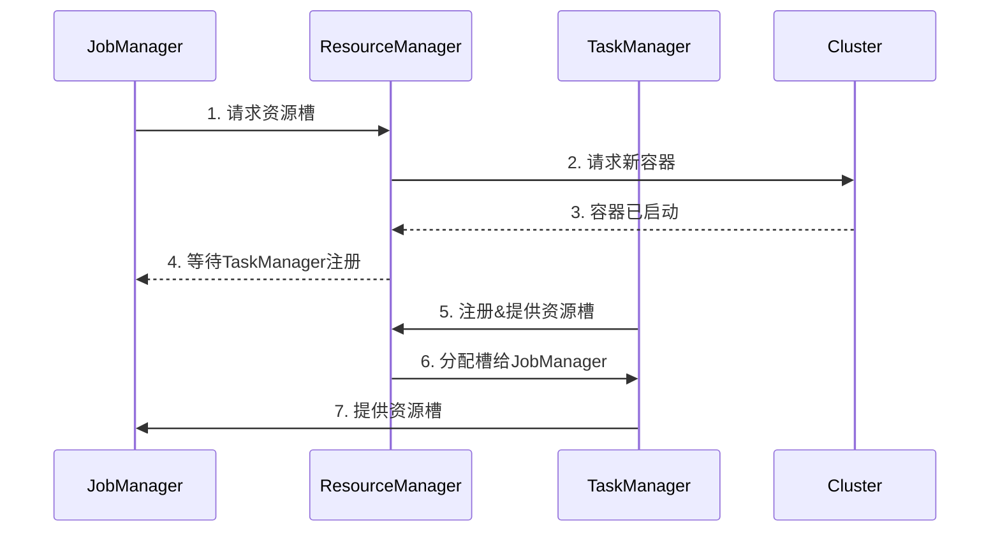
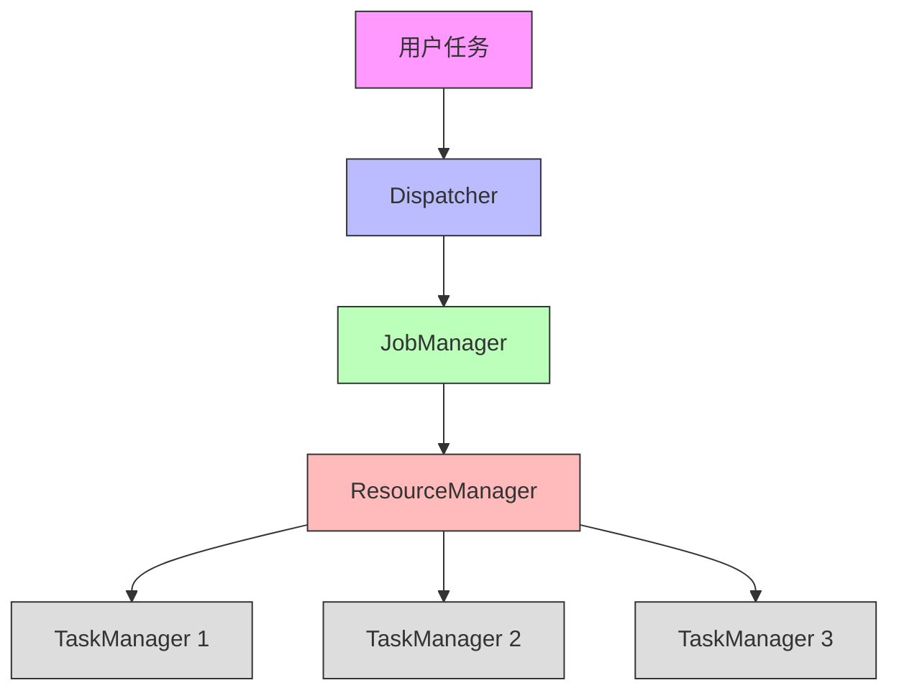
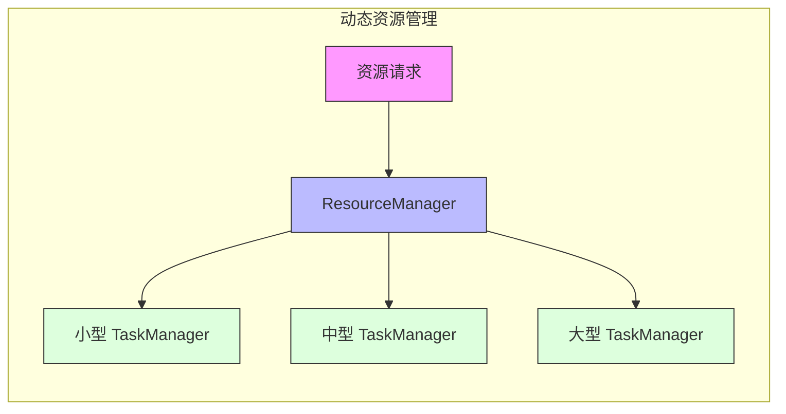
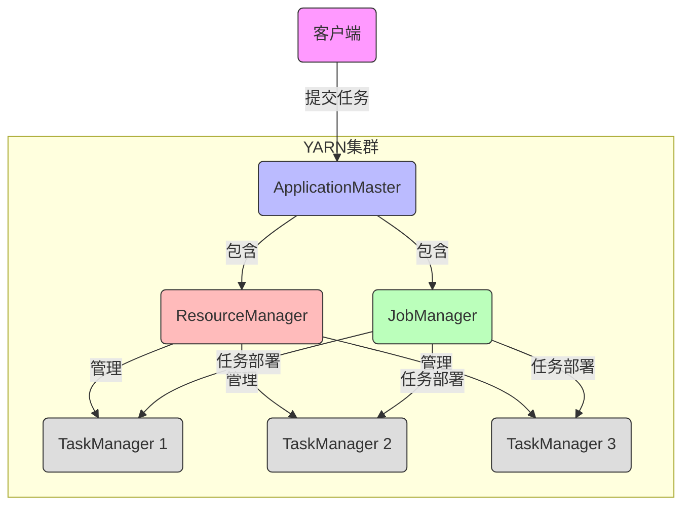
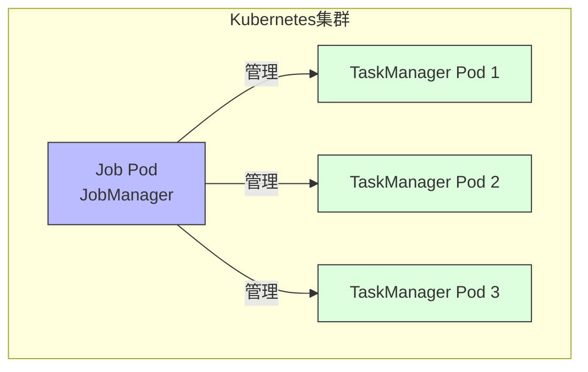
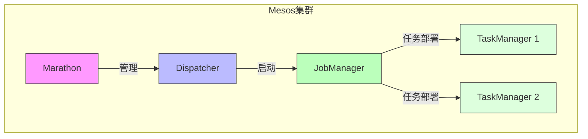

# FLIP-6：让 Flink 更好地运行在各种集群上

## 开篇

想象一下，你正在组织一个大型派对。你需要安排人手、分配空间、协调各个区域的活动。有些服务生可能只需要在某个时段工作，有些区域可能需要更多或更少的人手。如果能灵活地调配这些资源，派对就能运行得更加顺畅。

Flink 在集群上运行时也面临类似的问题。作为一个分布式系统，它需要在 YARN、Mesos、Kubernetes 等不同的集群管理系统上高效地运行。FLIP-6 就是为了解决这个问题而提出的改进方案，它让 Flink 能够更好地利用这些集群管理系统的特性。

让我们先来看看这个改进带来了哪些变化：

## 为什么需要这个改进？

在 FLIP-6 之前，Flink 在集群上运行时有一些让人头疼的问题：

### 资源分配太死板

就像餐厅在订座时必须一次性预留所有座位一样，Flink 任务在启动时需要一次性申请所有需要的资源。这样做有两个问题：一是可能预留太多资源造成浪费，二是如果临时需要增加资源就很麻烦。

### 容器大小千篇一律

想象一下，如果餐厅里所有桌子都必须是四人桌，遇到两人用餐或者六人聚会时就很不方便。Flink 在 YARN 上运行时也面临类似的问题 —— 所有的容器都必须是相同的大小，不能根据实际需求来调整。

### 部署流程繁琐

在 Docker 或 Kubernetes 环境下部署 Flink 任务时，需要先启动框架，然后再提交任务，就像必须先搭建舞台，才能开始演出一样。这个两步走的过程显得很不自然。

## FLIP-6 是如何解决这些问题的？

让我们通过一个简单的图来理解 FLIP-6 引入的新架构：

### 单一任务的 JobManager

FLIP-6 最重要的改变是让每个 JobManager 只负责一个任务。这就像是给每个演出都配备一个专门的舞台总监，不再是一个总监要同时管理多个演出。这样做有几个好处：

1. 职责更清晰：每个 JobManager 只需要关注自己负责的任务
2. 隔离性更好：一个任务的问题不会影响到其他任务
3. 更容易管理：任务结束后，相关的资源可以立即释放

### 灵活的 ResourceManager

ResourceManager 变成了一个更智能的资源管理者，它可以：

1. 按需分配资源：根据任务的实际需求来分配 TaskManager
2. 动态调整资源：可以在任务运行过程中增加或减少资源
3. 支持不同规格：可以启动不同配置（内存、CPU）的 TaskManager

## 不同集群管理器上的表现

### 在 YARN 上

YARN 环境下的改进特别明显：

主要改进：
- 任务提交更直接：客户端可以直接在 YARN 上启动任务
- 资源使用更高效：可以根据需要请求和释放容器
- 更好的隔离性：不同任务的资源互不影响

### 在 Kubernetes 上

在容器化环境中：
- 部署更自然：可以直接用 Docker 镜像部署整个任务
- 集成更简单：完全符合容器化的理念
- 扩展更方便：可以利用 Kubernetes 的自动扩缩容特性

### 在 Mesos 上

Mesos 环境下：
- 更好的资源调度：充分利用 Mesos 的细粒度资源管理
- 更灵活的部署：支持多种部署模式
- 更强的容错性：利用 Mesos 的服务发现机制

## 具体带来了哪些改进？

### 第一个改进：动态资源分配

现在 Flink 可以根据任务的实际需求动态地申请和释放资源。这就像餐厅可以根据客人数量灵活调整座位一样，提高了资源利用率。

### 第二个改进：异构容器支持

支持在同一个任务中使用不同规格的容器。比如计算密集型的操作可以使用更多的 CPU 资源，而内存密集型的操作可以使用更大的内存配置。

### 第三个改进：简化部署流程

特别是在容器环境下，现在可以像部署普通容器化应用一样部署 Flink 任务，不再需要分两步进行。

## 实际使用建议

### 1. 选择合适的部署模式

根据你的具体需求选择合适的部署模式：
- 如果需要快速启动单个任务，使用 per-job 模式
- 如果需要运行多个短任务，可以考虑 session 模式
- 在容器环境中，优先考虑使用原生的容器部署方式

### 2. 资源配置建议

- 根据操作类型配置合适的容器规格
- 为任务预留适当的资源余量
- 监控资源使用情况，及时调整配置

### 3. 高可用配置

- 配置 ZooKeeper 来实现 JobManager 的高可用
- 使用持久化存储保存检查点
- 设置合理的心跳超时时间

## 总结

FLIP-6 的改进让 Flink 在各种集群管理系统上运行得更加高效和灵活。它就像是给 Flink 装上了一个智能的资源调度系统，可以根据实际需求动态地调整资源，使任务运行更加顺畅。

这个改进也为 Flink 未来的发展打下了良好的基础。随着云原生技术的发展，容器化和动态资源管理变得越来越重要，FLIP-6 的这些改进让 Flink 能够更好地适应这些技术趋势。

值得一提的是，这个 FLIP 已经完成并发布在 Flink 1.5 版本中。它的成功实现标志着 Flink 在资源管理和部署方面达到了一个新的高度，为用户提供了更好的使用体验。
