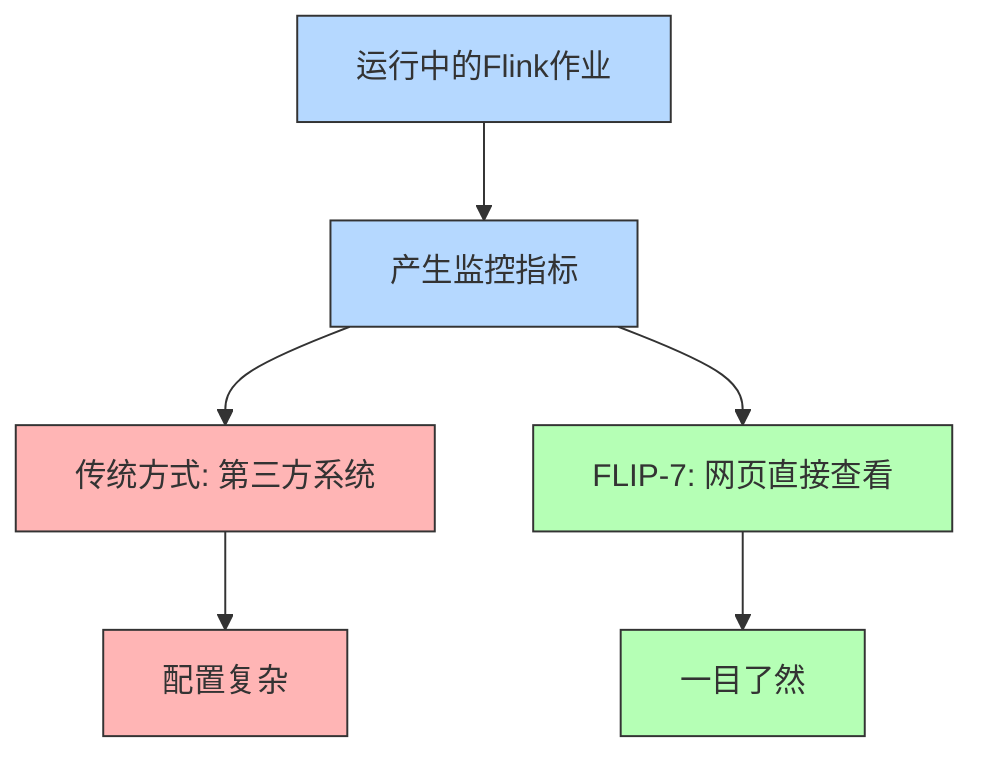
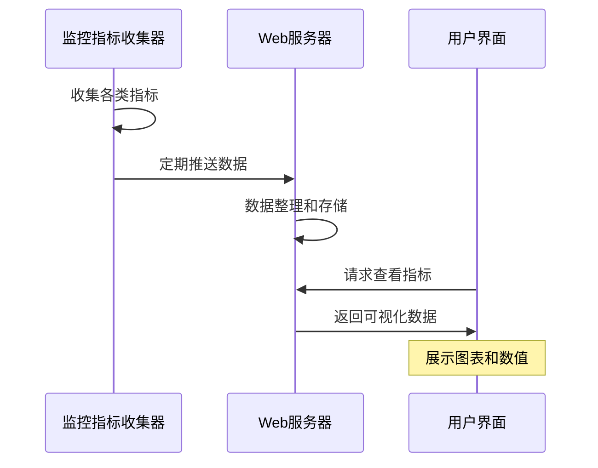

# FLIP-7 数据一目了然：Flink 让监控指标可视化

## 开篇

运行着一个 Flink 作业，但不知道它现在运行得怎么样了？这就像是开着一辆车，车窗上却糊着一层泥，看不清路况。在 Flink 早期版本中，虽然系统已经收集了很多监控指标，但这些数据都藏在系统深处，需要其他监控系统才能看到，用起来很不方便。FLIP-7 就是要解决这个问题，把这些重要的监控指标直接展示到 Flink 的网页界面上。

## 为什么需要在网页上看到监控指标？

就像现代汽车都有仪表盘，可以直接看到速度、油量、发动机温度等信息，Flink 的监控指标也需要一个直观的"仪表盘"。这样做有几个明显的好处：

### 1. 问题早发现
直接在网页上就能看到作业的运行状况，如果有任务处理太慢或者内存使用太多，一眼就能看出来。就像汽车的仪表盘发出警告一样，在问题变大之前就能提醒你。

### 2. 性能好把握
通过观察处理速度、延迟时间等指标，可以清楚地知道系统运行得是否高效。这就像开车时能随时看到速度表，知道是该加速还是减速。

### 3. 调优更准确
有了这些可视化的数据，调整系统参数时就不用靠猜了。比如看到某个任务总是占用很多内存，就知道该增加它的内存配置了。

## 具体改进了什么？

FLIP-7 主要做了这些改进：

### 1. 界面改进
在 Flink 的网页界面上添加了新的监控页面，可以显示：
- 任务处理速度
- 内存使用情况
- 数据积压情况
- 网络传输状态

### 2. 数据更新机制
- 定期自动刷新数据
- 可以选择查看实时数据或历史趋势
- 支持选择不同的时间范围

### 3. 展示方式优化
为了让数据更容易理解，采用了多种展示方式：
- 数字展示：直观显示具体数值
- 趋势图表：展示数据变化趋势
- 状态指示：用不同颜色标识系统状态

## 使用建议

在使用这个新功能时，有这些小贴士可以帮助你更好地监控系统：

### 监控重点指标

| 指标类型 | 重点关注什么 | 为什么重要 |
|---------|------------|-----------|
| 吞吐量 | 每秒处理的记录数 | 反映系统处理能力 |
| 延迟 | 数据处理的等待时间 | 影响实时性要求 |
| 背压 | 数据处理的积压情况 | 预警系统瓶颈 |
| 资源使用 | CPU、内存使用率 | 避免资源耗尽 |

### 合理使用刷新频率
- 运行关键任务时可以调高刷新频率
- 长期监控时可以适当调低频率，减少系统负担

## 总结

FLIP-7 就像是给 Flink 装上了一个现代化的仪表盘，让系统运行状况清晰可见。这个改进大大提高了 Flink 的可用性，让运维人员能够更好地掌控系统运行状况，及时发现和解决问题。

监控指标的可视化看似是个简单的改进，但它极大地改善了用户体验，就像汽车从没有仪表盘到有了现代化仪表盘的转变一样，让系统的运行状况变得一目了然。通过 FLIP-7，Flink 在易用性方面又迈出了重要的一步。
