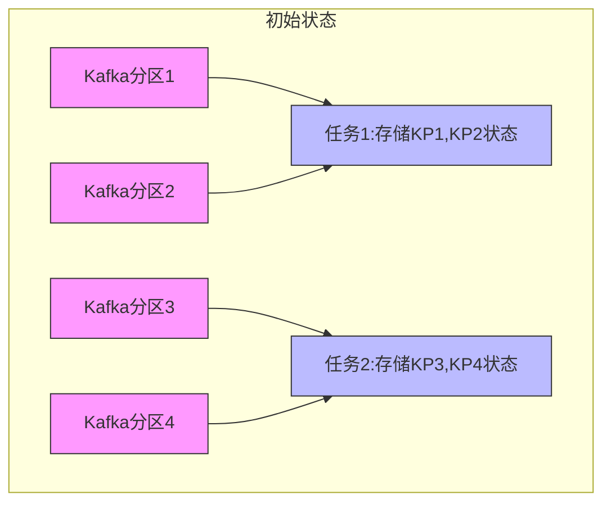
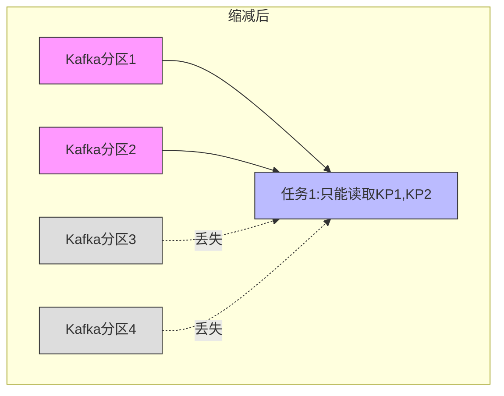
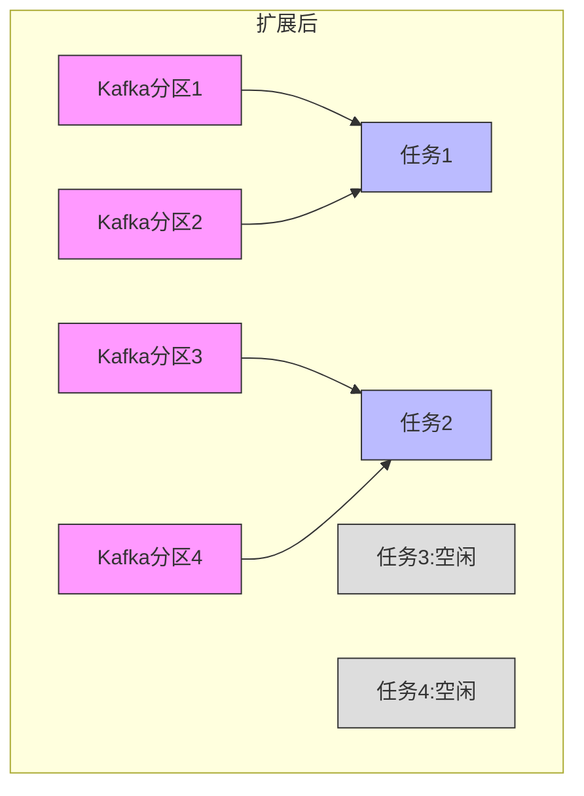
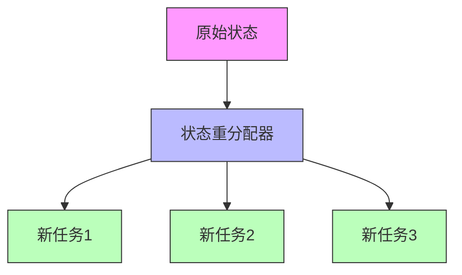
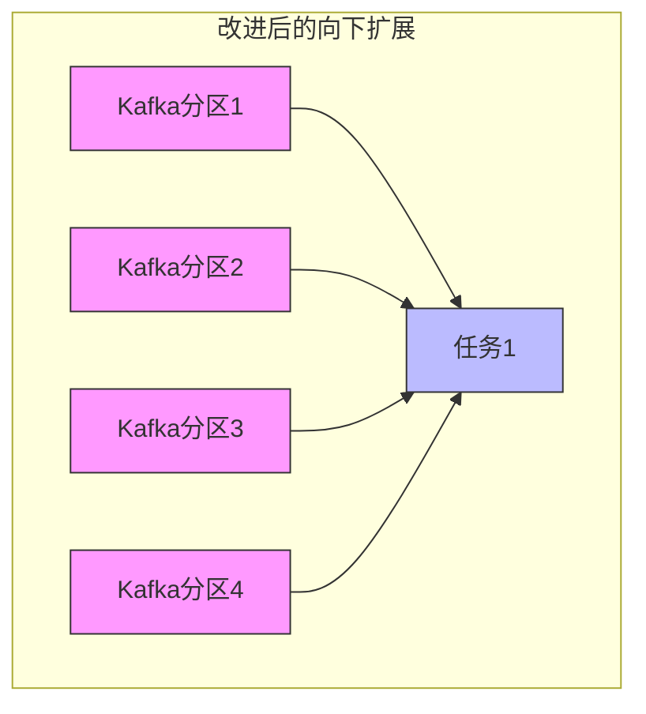
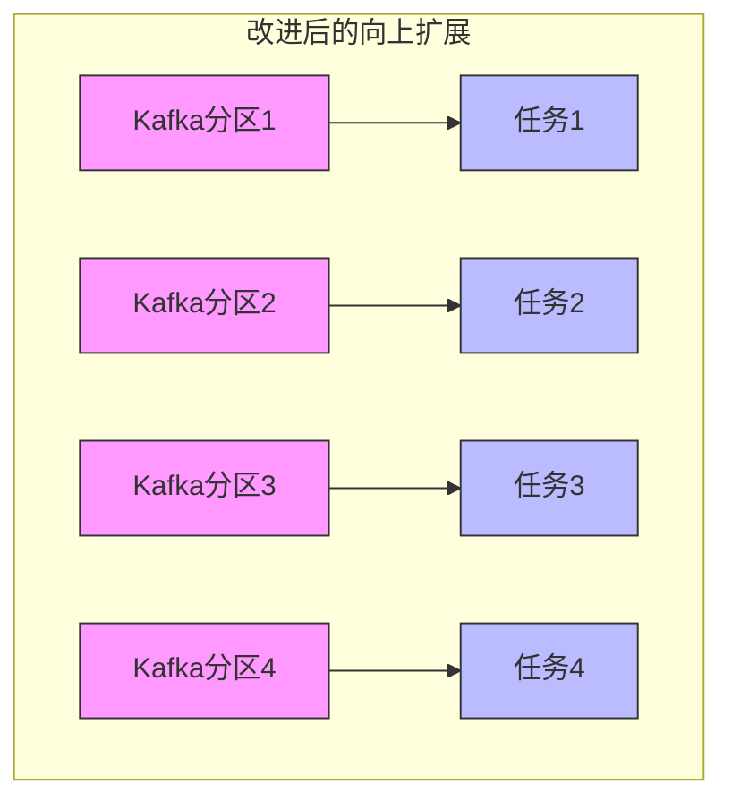

# FLIP-8：让非分区状态也能伸缩自如

在分布式系统中，数据的伸缩性是一个非常重要的特性。想象一下一个繁忙的餐厅厨房：如果只有一个厨师负责所有菜品，当订单增多时就会应接不暇。但如果能根据需要增加或减少厨师和工作台的数量，并且每个厨师都能接手其他厨师的工作，整个厨房就能高效运转。

## 什么是非分区状态？

在 Flink 中，状态主要分为两种：分区状态和非分区状态。

分区状态（Partitioned State）是与特定的键（key）相关联的状态。比如在处理用户购物行为时，每个用户的购物车状态就是分区状态，它会根据用户ID自然地分配到不同的任务中。这种状态的重新分配相对简单，因为键本身就为重新分配提供了自然的依据。

非分区状态（Non-partitioned State）则是与任务实例相关的整体状态，不依赖于具体的键。比如：
- Kafka 消费者需要记录每个分区的消费位置（offset）
- 文件源需要记录处理到的文件位置
- 计数器需要维护整体的计数值

这种状态原本是作为一个整体存在于每个任务中的，当需要增加或减少任务数量时，就面临着如何拆分或合并这些状态的挑战。

## 为什么需要这个改进？

让我们先用一个具体的例子来说明现状。假设我们正在使用 Kafka 数据源，它负责从 4 个 Kafka 分区读取数据，并且使用了 2 个 Flink 任务来处理：



在之前的版本中，当我们改变任务数量时会遇到两个重要问题：

### 向下扩展时的问题

当我们把任务数从 2 个减少到 1 个时：



原本属于任务2的状态（KP3、KP4的偏移量等信息）会丢失，导致这些分区的数据无法继续被处理。

### 向上扩展时的问题

当我们把任务数从 2 个增加到 4 个时：



新增的任务3和任务4会处于空闲状态，因为系统不知道如何将现有的状态重新分配给这些新任务。

## FLIP-8 是如何解决这个问题的？

FLIP-8 引入了一个全新的机制，让非分区状态可以在任务之间灵活迁移。这个改进主要包含三个核心部分：

### 1. 状态存储改进
引入了新的状态管理接口 OperatorStateStore，它能将状态以列表的形式存储。这就像是把一个大食堂的供餐任务分配给多个厨师，每个厨师负责准备部分食材和菜品。

```java
public interface OperatorStateStore {
    // 可以注册多个状态列表，每个列表都可以在任务间重新分配
    <T> ListState<T> getListState(String stateName, 
                                 TypeSerializer<T> serializer) 
        throws Exception;
}
```

### 2. 状态重分配策略
设计了灵活的状态重分配策略接口：



这种机制允许用户自定义如何在任务之间分配状态。目前系统默认提供了轮询分配策略，就像是把一锅菜平均分配到多个厨师的工作台上。

### 3. 简化的用户接口
为了让开发者更容易使用这个功能，提供了两个层次的接口：

- CheckpointedFunction：完整功能接口，适合需要精细控制的场景
- ListCheckpointed：简化版接口，适合简单的状态管理需求

```java
// 简化版接口示例
public interface ListCheckpointed<T extends Serializable> {
    // 保存状态时将数据放入列表
    List<T> snapshotState(long checkpointId) throws Exception;
    // 恢复状态时从列表中读取数据
    void restoreState(List<T> state) throws Exception;
}
```

## 实际效果如何？

让我们再看看改进后的 Kafka 源的行为：

### 向下扩展时：



所有状态都会合并到剩余的任务中，确保没有数据丢失。

### 向上扩展时：



状态会被均匀地分配到所有任务中，充分利用新增的计算资源。

## 这个改进已经实现了吗？

是的，这个改进已经在 Flink 1.2.0 版本中实现。而且从实践来看，它不仅解决了 Kafka 连接器的扩展问题，还为其他需要管理非分区状态的场景提供了良好的解决方案。

## 实现细节

为了保证这个功能的可靠性和性能，实现中包含了以下关键设计：

### 类型序列化
每个状态都配备了独立的序列化器，这确保了即使状态的数据格式发生变化，老的检查点和保存点仍然可以正确恢复。这就像是让每个厨师都掌握了标准的菜品制作配方，确保即使厨师调换，菜品的口味和质量也能保持一致。

### 安全的状态管理
在进行状态重分配时，系统会确保：
1. 状态的完整性 - 不会丢失数据
2. 一致性 - 所有任务的状态都是同步更新的
3. 故障恢复 - 如果重分配过程中出现故障，可以回滚到之前的状态

### 性能优化
系统采用了惰性反序列化策略，只有在真正需要使用状态时才进行反序列化，这样可以减少不必要的性能开销。

## 总结

FLIP-8 的实现让 Flink 在处理非分区状态时变得更加灵活和强大。它就像是给餐厅配备了一个智能的任务调度系统，可以根据就餐高峰动态调整厨师的工作分工，让整个厨房运转更加高效和可靠。这个改进不仅使得 Kafka 连接器可以更好地工作，还为其他需要动态扩展的场景提供了通用的解决方案。
