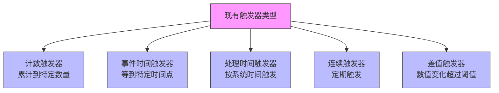
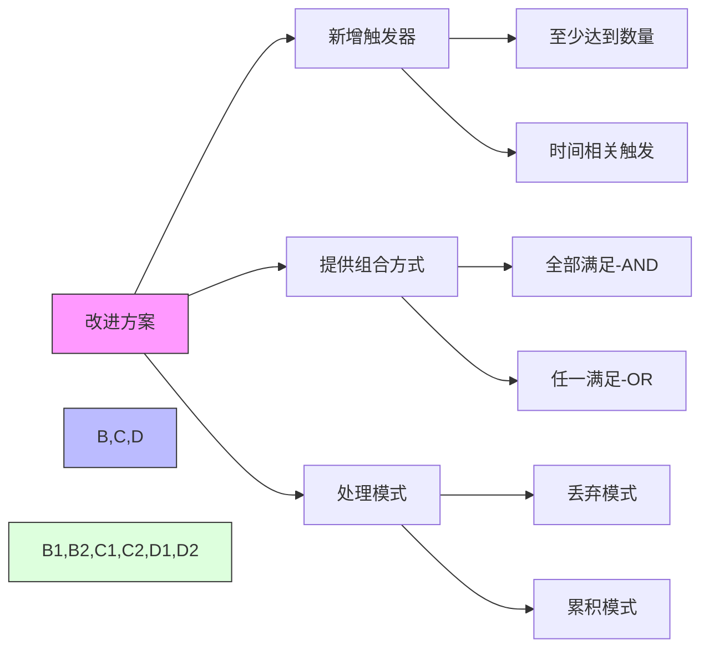

# FLIP-9 触发器语言：一次定义规则的尝试

## 开篇

设想一个闹钟系统：有时想在固定时间醒来（比如早上7点），有时想睡够特定时长（比如8小时），有时还想等到阳光足够明亮才醒。在日常生活中，这些唤醒条件可以随意组合 —— 比如"早上7点或者睡够8小时，哪个条件先到就响铃"。

Flink 中的触发器（Trigger）就像这样一个闹钟系统，它决定了什么时候该处理数据。但遗憾的是，当时的触发器没那么灵活，没法像闹钟一样组合多个条件。FLIP-9 就是想要解决这个问题，让触发规则的编写变得像设置闹钟一样简单直观。不过这个提案最终被搁置了，为什么呢？

## 当时的触发器有什么问题？

这些触发器虽然能用，但有两个明显的不足：

### 不能组合使用

就像闹钟如果只能设置"定点响铃"或"计时响铃"，而不能设置"定点或计时到，先到先响"这样的组合条件。在 Flink 中，你也没法把"数据累积到一定量"和"到达某个时间点"这两个条件组合使用。

### 不能灵活处理延迟数据

假设闹钟响过了但你没醒，这时它应该继续响还是等下一次再响？对于延迟到达的数据也是类似的问题。虽然系统允许设置一个等待时间，但没法为这些"迟到"的数据指定特殊的处理规则。就像闹钟不能设置"如果第一次没醒，那就每隔5分钟响一次，直到起床"这样的规则。

## FLIP-9 想要怎么改进？

FLIP-9 提出了一种更灵活的方案：

1. **新增基础触发器**：
   - 就像闹钟可以按时间（"早上7点"）或按时长（"睡够8小时"）来响铃
   - 在 Flink 里就是可以按数据量或按时间来触发处理

2. **提供组合方式**：
   - 可以说"条件都满足才触发"（就像"闹钟响了并且天亮了才起床"）
   - 也可以说"满足任一条件就触发"（就像"闹钟响了或者天亮了就起床"）

3. **支持两种处理模式**：
   - 触发后重新计算：就像闹钟响了就重新设置下一次闹铃
   - 触发后继续积累：就像贪睡模式，响了之后继续计时

## 为什么最后没有采用？

这个提案最终被搁置了，主要原因是：

1. **实现起来太复杂**：要让系统支持这么灵活的组合，就像要把简单的闹钟改造成一个智能管家，工作量太大了。
2. **实际需求不多**：大多数用户用基本的触发方式就够了，就像大多数人只需要最简单的定时闹钟。
3. **维护成本太高**：功能越复杂，后期维护和升级就越困难，就像智能产品比简单产品更容易出问题。

## 总结

FLIP-9 这个案例表明，有些看起来很好的想法，实现起来可能会遇到意想不到的困难。有时候，保持简单反而是更明智的选择。这个提案虽然没有被采用，但其中探讨的问题以及决策过程，都为后续的改进提供了很好的参考。

如果你正在使用 Flink，目前可以通过自定义触发器来实现特殊的触发需求。虽然可能需要写更多代码，但这种方式反而更灵活，也更容易理解和维护。
